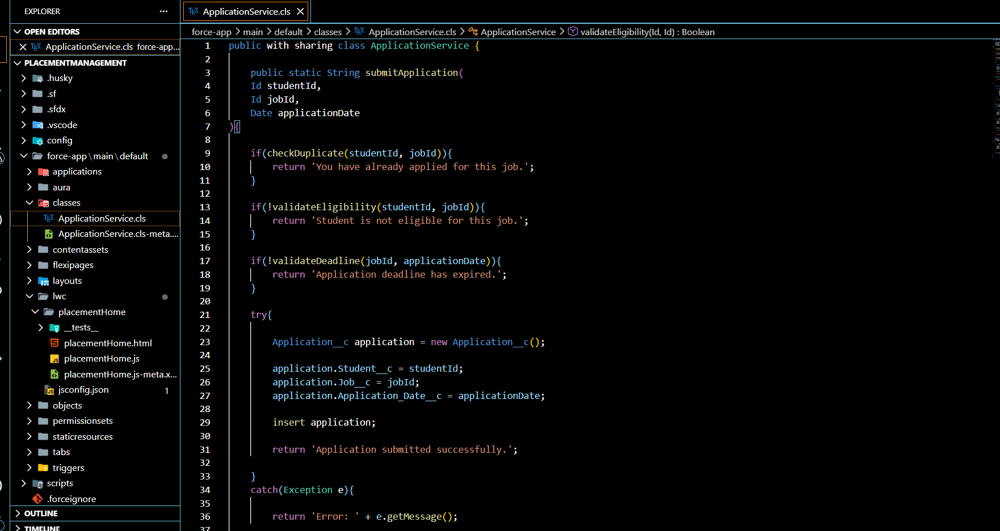
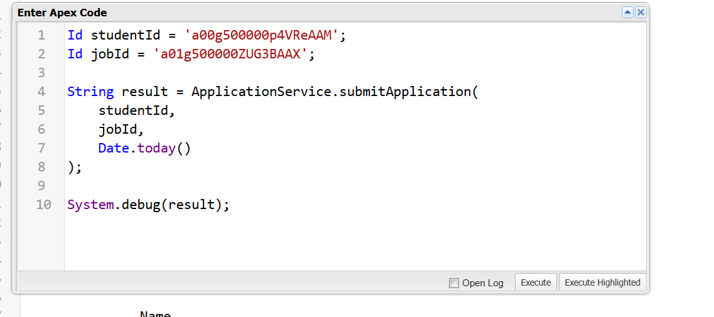
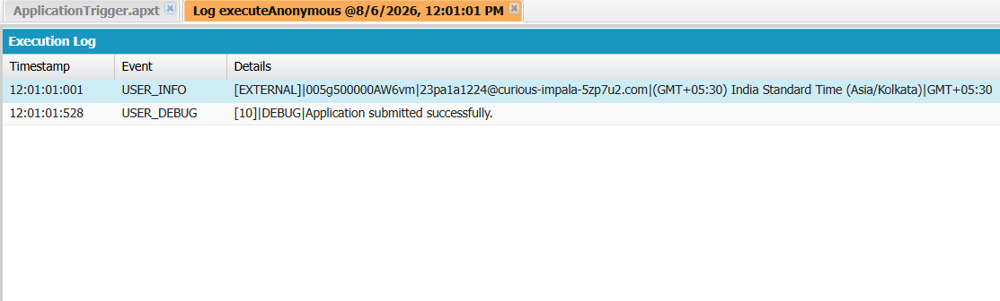

# Salesforce Interview Readiness Bootcamp – Day 5

##  Project Overview

Day 5 focuses on implementing business logic using **Apex Service Classes**. Instead of placing all business rules inside triggers or user interfaces, a dedicated service class named **ApplicationService** was created to handle the complete application submission workflow.

The project demonstrates how to organize business logic using clean engineering principles while validating student applications before saving them into Salesforce.

---

#  Sprint Objectives

The following user stories were implemented:

- Accept a student application
- Prevent duplicate applications
- Validate student eligibility
- Validate application deadline
- Save the application record
- Display meaningful success and error messages

---

#  Business Scenario

The Placement Office wants students to apply for jobs through the Placement Management System.

Before saving an application, the system must verify that:

- The student has not already applied.
- The student satisfies the minimum CGPA requirement.
- The application deadline has not expired.
- The application is saved successfully only after all validations pass.

---

#  Architecture

```
Student Clicks Apply
        │
        ▼
submitApplication()
        │
        ▼
checkDuplicate()
        │
        ▼
validateEligibility()
        │
        ▼
validateDeadline()
        │
        ▼
Insert Application Record
        │
        ▼
Return Success / Error Message
```

---

#  Implementation

##  ApplicationService Class

A dedicated service class was created to manage all application-related business logic.

### Methods Implemented

### submitApplication()

Receives:

- Student Id
- Job Id
- Application Date

Acts as the main entry point for the complete workflow.

---

### checkDuplicate()

Checks whether the student has already applied for the selected job.

If a duplicate exists:

```
You have already applied for this job.
```

Otherwise, processing continues.

---

### validateEligibility()

Validates whether:

- Student CGPA ≥ Job Minimum CGPA

If the student is not eligible:

```
Student is not eligible for this job.
```

---

### validateDeadline()

Checks whether:

```
Application Date <= Job Last Date
```

If the application deadline has passed:

```
Application deadline has expired.
```

---

### Save Application

After all validations pass, the application is saved using Apex DML.

```apex
insert application;
```

If the operation succeeds:

```
Application submitted successfully.
```

Otherwise, an exception message is returned.

---

#  Project Screenshots

## Application Service Class



---

## Execute Anonymous Test



---

## Application Record


---

## Debug Log



---

#  Engineering Principles Learned

- Keep business logic separate from the user interface.
- Every class should have a single responsibility.
- Every method should solve one problem.
- Build software incrementally.
- Use meaningful method names.
- Validate before saving.
- Return meaningful messages to users.

---

#  Learning Outcomes

Through this project I learned:

- Apex Service Classes
- Service Layer Design
- Helper Methods
- SOQL Queries
- DML Operations
- Exception Handling
- Business Rule Validation
- Clean Code Practices
- Single Responsibility Principle

---

#  Interview Questions

### What is a Service Class?

A Service Class contains business logic related to a specific business process. It keeps logic separate from the user interface and improves code maintainability.

---

### Why use helper methods?

Helper methods improve readability, reduce duplicate code, and make the application easier to maintain and test.

---

### Why validate before saving?

Validating before performing DML prevents invalid records from being stored and provides immediate feedback to the user.

---

### Why use try-catch?

To handle unexpected DML exceptions gracefully and return meaningful error messages instead of system failures.

---

### What is the advantage of separating business logic?

- Better readability
- Easier testing
- Reusability
- Simpler maintenance
- Clear separation of responsibilities

---

#  Technologies Used

- Salesforce Apex
- SOQL
- DML
- Salesforce Developer Edition
- VS Code
- Salesforce CLI
