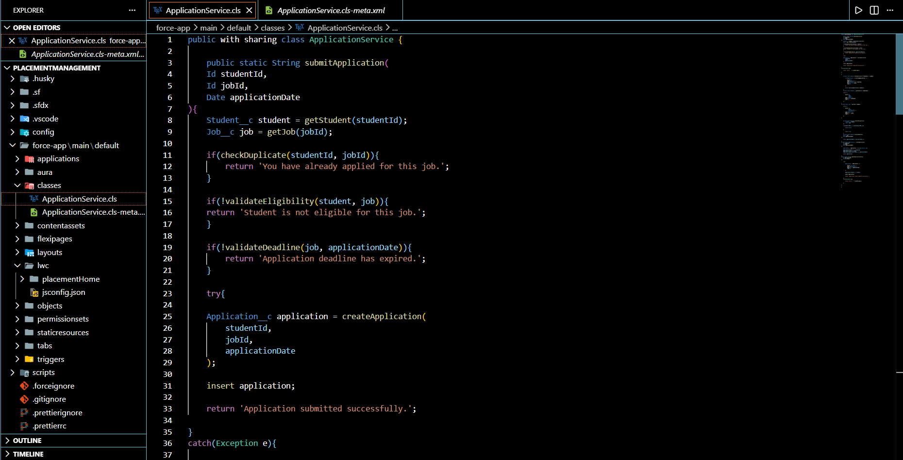
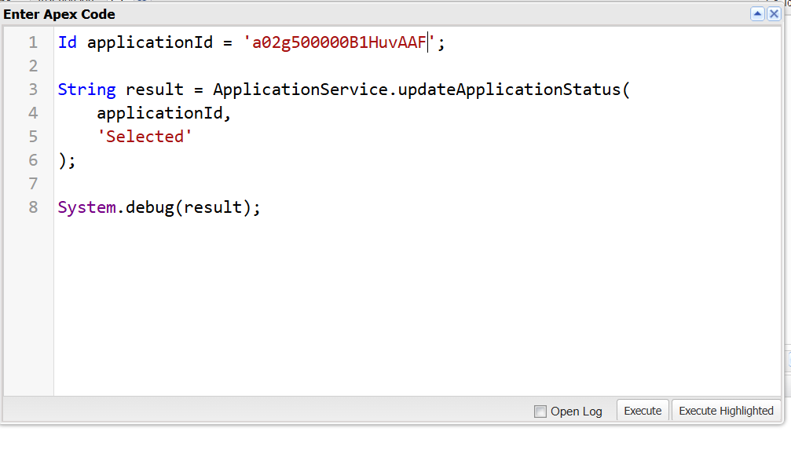
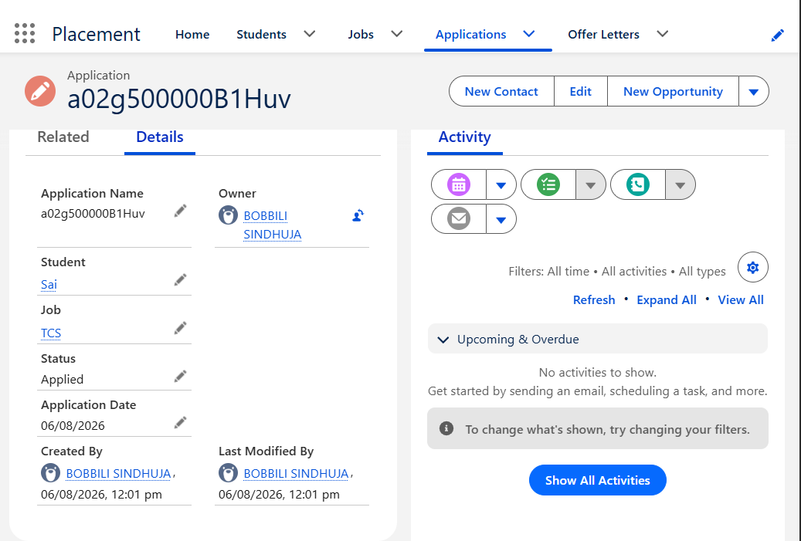
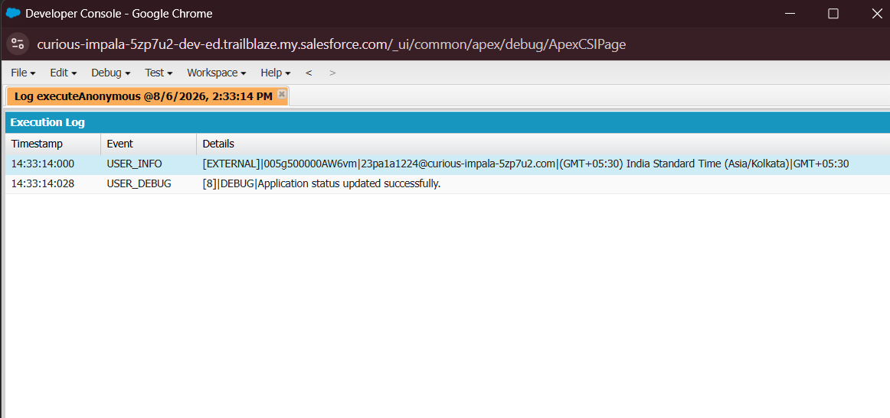
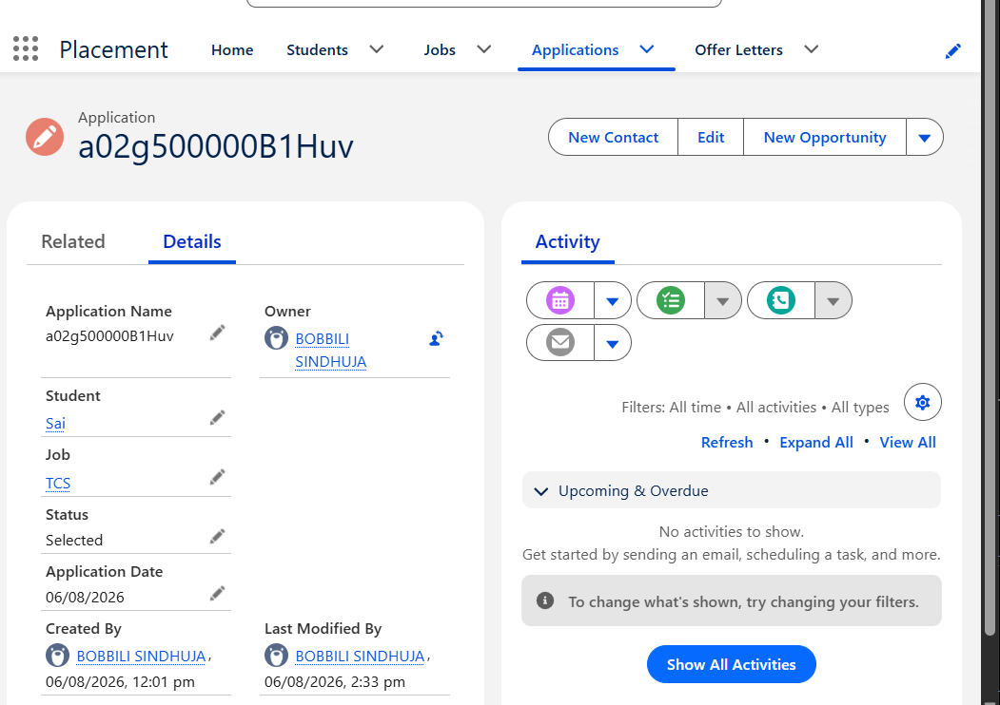

#  Salesforce Interview Readiness Bootcamp – Day 06

##  Project Overview

Day 06 focuses on building a complete business transaction using **Apex, SOQL, and DML**. The objective is to design a clean service layer that retrieves business data, validates application rules, creates records, updates existing records, and returns meaningful feedback.

This implementation follows enterprise software development practices by separating responsibilities into reusable methods and performing all business validations before modifying Salesforce data.

---

#  Sprint Objectives

The following user stories were implemented:

- Retrieve Student Information
- Retrieve Job Eligibility Criteria
- Prevent Duplicate Applications
- Create and Save Application Records
- Update Application Status
- Return Meaningful Feedback

---

#  Business Scenario

A student applies for a job through the Placement Management System.

Before accepting the application, the software must:

- Retrieve student information.
- Retrieve job eligibility criteria.
- Check whether the student has already applied.
- Verify student eligibility.
- Verify the application deadline.
- Create and save the application.
- Allow recruiters to update the application status.
- Display appropriate success or error messages.

---

#  Business Transaction Workflow

```text
Receive Request
        │
        ▼
Retrieve Student
        │
        ▼
Retrieve Job
        │
        ▼
Check Duplicate
        │
        ▼
Validate Eligibility
        │
        ▼
Validate Deadline
        │
        ▼
Create Application
        │
        ▼
Save Record
        │
        ▼
Update Application Status
        │
        ▼
Return Confirmation
```

---

#  Implementation

##  submitApplication()

Main service method responsible for handling the complete application submission process.

### Responsibilities

- Retrieve Student
- Retrieve Job
- Check Duplicate Application
- Validate Eligibility
- Validate Application Deadline
- Create Application Record
- Save Application using DML
- Return Success/Error Message

---

##  getStudent()

Retrieves only the required Student information using SOQL.

### Retrieved Fields

- Id
- Name
- CGPA

Engineering Principle:

> Retrieve only the information required for business validation.

---

##  getJob()

Retrieves the required Job information using SOQL.

### Retrieved Fields

- Id
- Name
- Minimum CGPA
- Last Date

Engineering Principle:

> Avoid unnecessary fields to improve performance.

---

##  checkDuplicate()

Checks whether the student has already applied for the selected job.

### Behaviour

- Duplicate Found → Reject Application
- No Duplicate → Continue Processing

---

##  validateEligibility()

Compares

- Student CGPA
- Job Minimum CGPA

If

```
Student CGPA < Minimum CGPA
```

Application is rejected.

---

##  validateDeadline()

Checks whether

```
Application Date <= Job Last Date
```

If the application deadline has expired, the application is rejected.

---

##  createApplication()

Creates a new Application record.

Populates

- Student
- Job
- Application Date

Returns the populated Application object.

---

##  Save Application

After all validations succeed,

the application is saved using

```apex
insert application;
```

---

##  updateApplicationStatus()

Retrieves an existing Application record.

Updates

- Status

Possible values include:

- Applied
- Shortlisted
- Interview Scheduled
- Selected
- Rejected

Finally,

```apex
update application;
```

is executed.

---

# 📸 Project Screenshots

## Application Service Class



---

## Submit Application Test



---

## Application Record Created



---

## Update Application Status



---

## Updated Application Record



---

# Engineering Principles Learned

- Retrieve only the information required.
- Separate business logic into reusable methods.
- Perform all validations before DML.
- Keep every method focused on one responsibility.
- Design services that are easy to maintain.
- Write readable and reusable code.

---

#  Learning Outcomes

Through this project I learned:

- Apex Service Layer Design
- SOQL Query Optimization
- DML Operations
- Business Transaction Design
- Business Rule Validation
- Record Creation
- Record Update
- Exception Handling
- Clean Code Practices
- Single Responsibility Principle

---

# Interview Questions

### Why is SOQL executed before DML?

SOQL retrieves the information required for business validation. DML should only be executed after all business rules have been verified.

---

### Why retrieve only required fields?

Retrieving only required fields improves performance, reduces resource usage, and keeps queries efficient.

---

### Why should DML happen after validation?

Saving records before validation may introduce incorrect or invalid business data into Salesforce.

---

### Why use helper methods?

Helper methods improve readability, reduce duplicate code, simplify maintenance, and promote code reuse.

---

### Why use a Service Class?

A Service Class centralizes business logic, separates responsibilities, and makes applications easier to test, maintain, and extend.

---

### What makes this architecture maintainable?

Each method has a single responsibility:

- getStudent()
- getJob()
- checkDuplicate()
- validateEligibility()
- validateDeadline()
- createApplication()
- updateApplicationStatus()

This makes the code easy to understand and modify.

---

#  Technologies Used

- Salesforce Apex
- SOQL
- DML
- Salesforce Developer Edition
- Visual Studio Code
- Salesforce CLI

---

#  Key Achievement

Successfully implemented a complete end-to-end business transaction that:

- Retrieves business data
- Validates application rules
- Prevents duplicate applications
- Creates application records
- Updates application status
- Returns meaningful user feedback

using clean service-layer architecture and Salesforce best practices.
