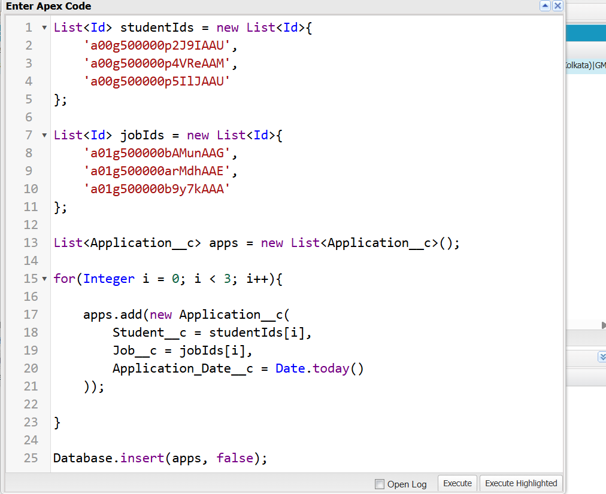
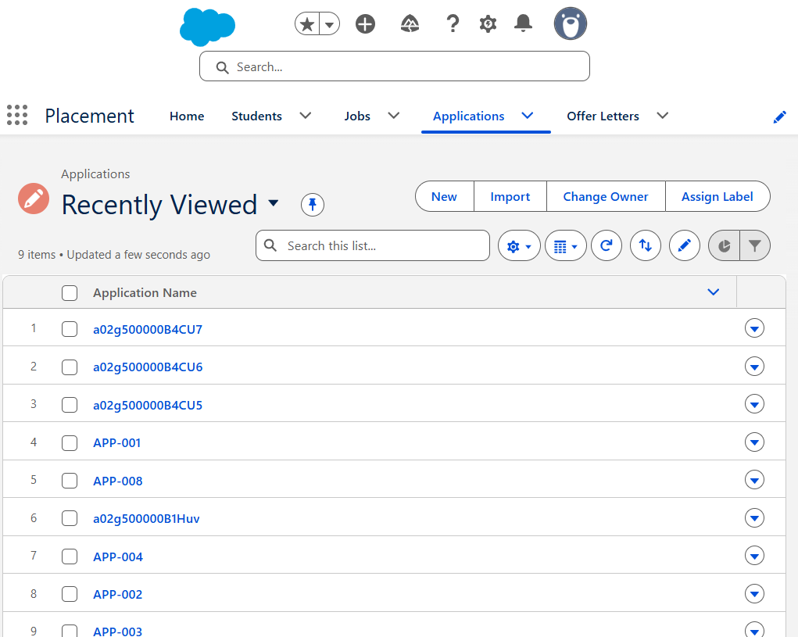
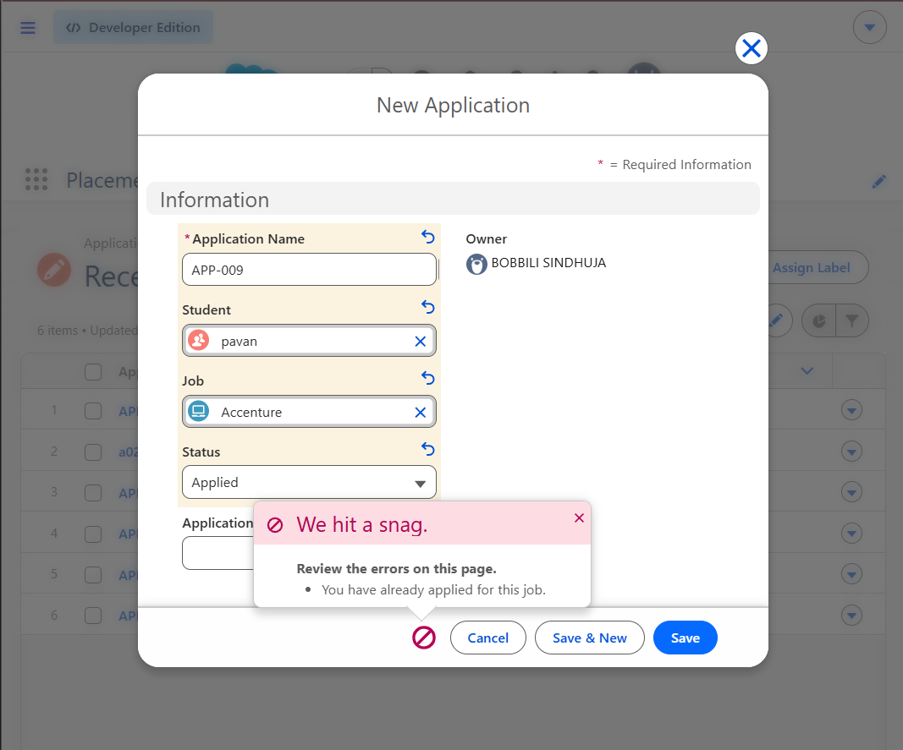
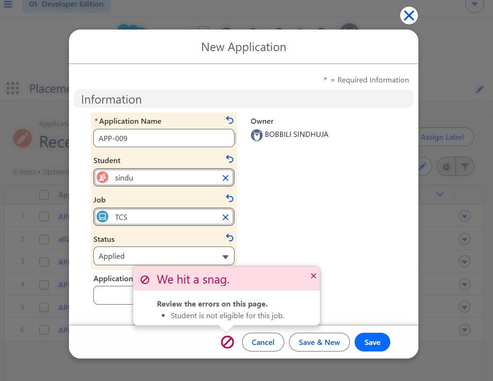
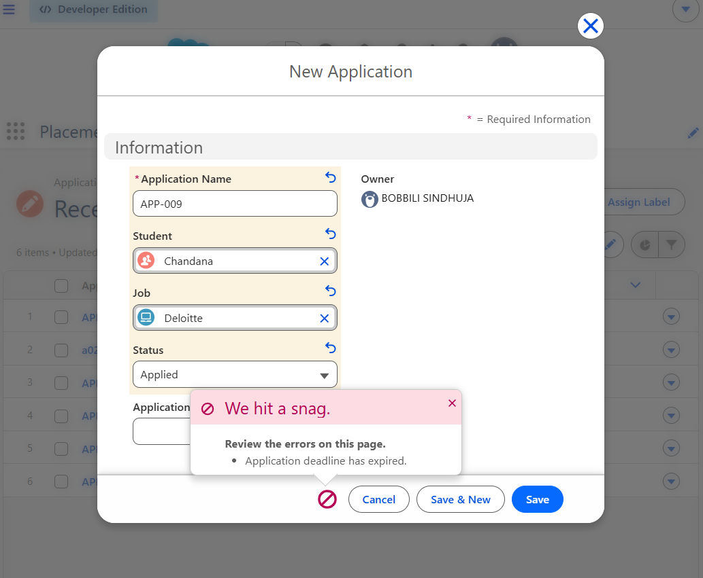

#  Salesforce Interview Readiness Bootcamp – Day 08

##  Project Overview

Day 08 focuses on implementing **Bulk Processing** and **Governor Limits** in Salesforce Apex. The project enhances the existing Placement Management System by making the Trigger and Service Layer capable of processing multiple records efficiently in a single transaction.

The implementation follows Salesforce best practices by eliminating **SOQL** and **DML** operations inside loops, using **Sets** and **Maps** for efficient data retrieval, and designing scalable Trigger logic.

---

#  Sprint Objectives

Successfully implemented the following engineering tasks:

- Bulkify Trigger processing
- Eliminate SOQL inside loops
- Eliminate DML inside loops
- Retrieve records using Sets and Maps
- Bulk-safe duplicate validation
- Optimize Apex code for Governor Limits

---

#  Business Scenario

The Placement Office may import hundreds of student applications at once.

Instead of processing one record at a time, the application should:

- Process multiple Application records together
- Retrieve Student records using a single SOQL query
- Retrieve Job records using a single SOQL query
- Validate all records efficiently
- Prevent duplicate applications
- Respect Salesforce Governor Limits

---

#  Bulk Processing Workflow

```text
Receive Multiple Applications
           │
           ▼
Collect Student IDs (Set)
           │
           ▼
Collect Job IDs (Set)
           │
           ▼
Retrieve Students (Single SOQL)
           │
           ▼
Retrieve Jobs (Single SOQL)
           │
           ▼
Store Records in Maps
           │
           ▼
Validate Applications
           │
           ▼
Prevent Duplicate Applications
           │
           ▼
Save Valid Records
```

---

#  Implementation

##  Bulk-safe Trigger

The Trigger processes multiple Application records in a single transaction.

### Trigger Events

- Before Insert
- After Update

Responsibilities:

- Receive Trigger records
- Delegate processing to ApplicationService
- Avoid business logic inside the Trigger

---

##  Bulkified Student Retrieval

Student IDs are collected using a Set.

```apex
Set<Id> studentIds = new Set<Id>();
```

Students are retrieved using a single SOQL query.

---

##  Bulkified Job Retrieval

Job IDs are collected using a Set.

```apex
Set<Id> jobIds = new Set<Id>();
```

Jobs are retrieved using a single SOQL query.

---

##  Using Maps

Retrieved records are stored in Maps for fast lookup.

```apex
Map<Id, Student__c> studentsById;
Map<Id, Job__c> jobsById;
```

This avoids repeated database queries.

---

##  Bulk Duplicate Validation

Existing applications are retrieved using a single SOQL query.

Applications are stored in a Set for efficient duplicate detection.

---

##  Eligibility Validation

Each Application is validated against:

- Student CGPA
- Job Minimum CGPA

Only valid applications continue processing.

---

##  Deadline Validation

The application date is compared with the Jobs last application date.

Applications submitted after the deadline are rejected.

---
#  Project Screenshots

## Bulk Insert Test



---
## Bulk Insert Data



## Duplicate Validation



---

## Eligibility Validation


## Deadline Validation



---

#  Engineering Principles

This project follows Salesforce best practices:

- Avoid SOQL inside loops
- Avoid DML inside loops
- Use Sets for unique record collection
- Use Maps for efficient data retrieval
- Bulkify Trigger processing
- Reduce Governor Limit consumption
- Write scalable Apex code

---

#  Learning Outcomes

Through this project I learned:

- Salesforce Bulk Processing
- Governor Limits
- Bulk-safe Trigger Design
- Set Collection
- Map Collection
- SOQL Optimization
- Duplicate Validation
- Efficient Apex Coding
- Scalable Service Layer Design

---

#  Interview Questions

### What is Bulk Processing?

Bulk Processing is the ability to process multiple Salesforce records efficiently within a single transaction while respecting Governor Limits.

---

### Why should SOQL not be written inside loops?

SOQL inside loops increases the number of database queries and may exceed Salesforce Governor Limits.

---

### Why should DML not be written inside loops?

Executing DML inside loops increases the number of database operations and can exceed the maximum DML limit per transaction.

---

### Why use Sets?

Sets automatically remove duplicate values and are useful for collecting unique record IDs.

---

### Why use Maps?

Maps provide fast access to records using their IDs and eliminate repeated database queries.

---

### What are Governor Limits?

Governor Limits are Salesforce platform limits that ensure efficient and fair use of shared resources by all applications.

---

#  Technologies Used

- Salesforce Apex
- Apex Triggers
- SOQL
- DML
- Sets
- Maps
- Salesforce CLI
- Visual Studio Code

---

#  Key Achievement

Successfully refactored the Placement Management System to support bulk processing by eliminating SOQL and DML operations inside loops, implementing Set and Map collections, and designing a scalable, Governor Limit-compliant Apex solution.
