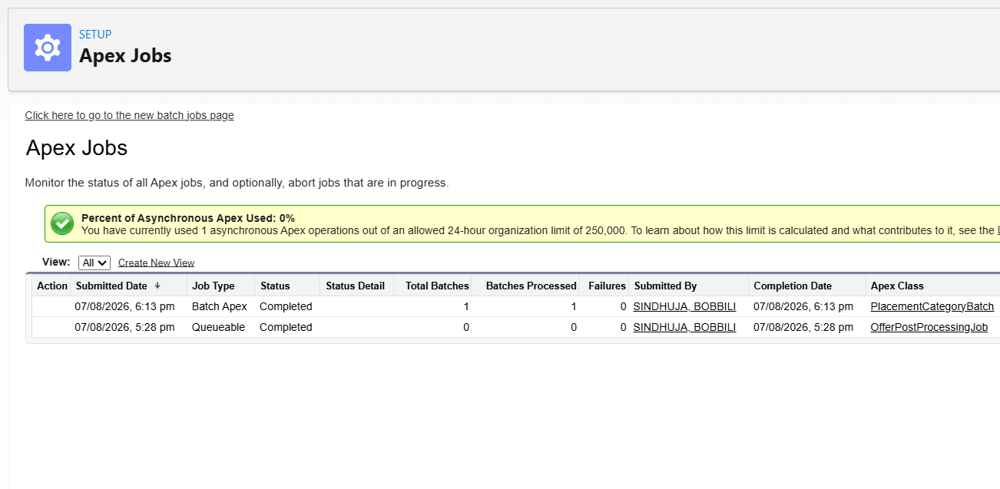
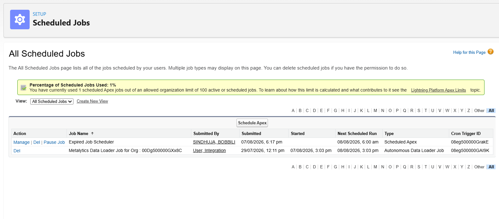
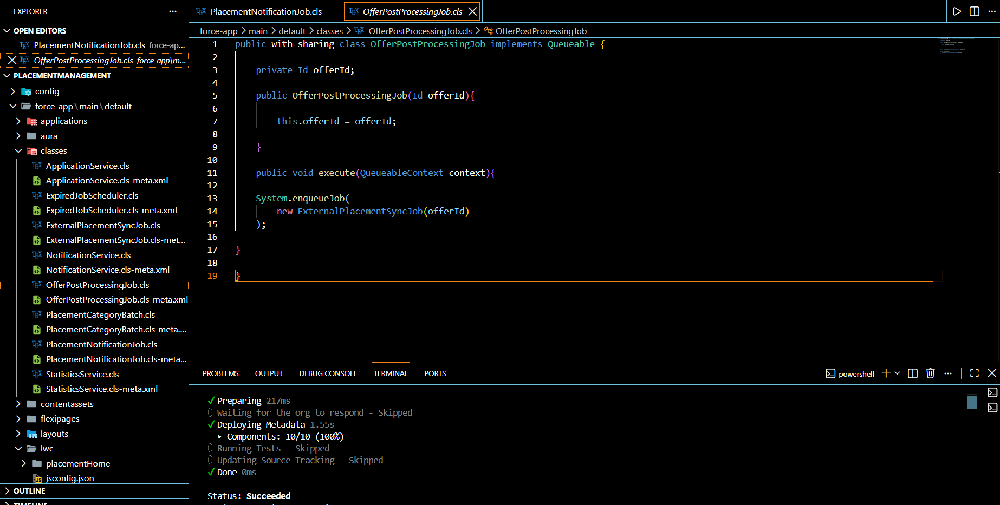

#  Salesforce Interview Readiness Bootcamp – Day 09

##  Project Overview

Day 09 focuses on implementing **Asynchronous Apex** to improve application performance, scalability, and maintainability.

The project demonstrates how Salesforce executes long-running tasks in the background using **Queueable Apex**, **Queueable Chaining**, **Batch Apex**, and **Scheduled Apex**.

Instead of making users wait for secondary operations, the application separates immediate business logic from background processing.

---

#  Sprint Objectives

Successfully implemented the following engineering tasks:

- Separate synchronous and asynchronous work
- Create Queueable Apex jobs
- Implement Queueable Chaining
- Process large datasets using Batch Apex
- Schedule recurring business processes
- Design scalable asynchronous architecture

---

#  Business Scenario

When a student accepts an offer, the system performs multiple operations.

### Must Happen Immediately

- Validate the offer
- Update application status
- Update student placement status
- Return confirmation to the user

### Can Happen Later

- External placement synchronization
- Notification processing
- Analytics processing

This separation improves user experience by reducing response time.

---

#  Asynchronous Workflow

```text
Student Accepts Offer
          │
          ▼
Update Application Status
          │
          ▼
OfferPostProcessingJob
          │
          ▼
ExternalPlacementSyncJob
          │
          ▼
PlacementNotificationJob
```

---

#  Scheduled Batch Workflow

```text
Scheduled Apex
        │
        ▼
ExpiredJobScheduler
        │
        ▼
PlacementCategoryBatch
        │
        ▼
Process Large Dataset
```

---

#  Implementation

##  Queueable Apex

Created **OfferPostProcessingJob** to move background processing outside the user transaction.

Responsibilities:

- Start background processing
- Improve user response time
- Delegate additional work

---

##  Queueable Chaining

Implemented two Queueable jobs.

### ExternalPlacementSyncJob

Responsibilities:

- Simulate external placement synchronization
- Start the next Queueable job

### PlacementNotificationJob

Responsibilities:

- Prepare notification processing
- Keep responsibilities separated

---

##  Batch Apex

Created **PlacementCategoryBatch** implementing:

- `start()`
- `execute()`
- `finish()`

Responsibilities:

- Retrieve records using QueryLocator
- Process records in batches
- Perform bulk updates
- Execute completion logic

---

##  Scheduled Apex

Created **ExpiredJobScheduler**.

Responsibilities:

- Execute automatically at scheduled time
- Launch Batch Apex
- Separate scheduling logic from business logic

---

# 📸 Project Screenshots

## Apex Jobs



---

## Scheduled Jobs



---

## VS Code Project Structure



---

#  Engineering Principles

This project follows enterprise Salesforce architecture principles:

- Separate synchronous and asynchronous processing
- Keep user transactions lightweight
- Delegate long-running tasks to Queueable Apex
- Use Queueable Chaining for sequential background processing
- Process large datasets using Batch Apex
- Use Scheduled Apex for time-based automation
- Maintain clean separation of responsibilities

---

#  Learning Outcomes

Through this project I learned:

- Asynchronous Apex
- Queueable Apex
- Queueable Chaining
- Batch Apex
- Scheduled Apex
- Background Processing
- Batch Lifecycle
- QueryLocator
- Scalable Apex Design
- Clean Asynchronous Architecture

---

#  Interview Questions

### What is Asynchronous Apex?

Asynchronous Apex allows long-running operations to execute in the background without blocking the user transaction.

---

### When should Queueable Apex be used?

Queueable Apex is suitable for structured background processing that does not need to complete during the user transaction.

---

### What is Queueable Chaining?

Queueable Chaining allows one Queueable job to enqueue another Queueable job after successful completion, enabling sequential background processing.

---

### When should Batch Apex be used?

Batch Apex is used to process very large datasets by dividing records into smaller batches, each executing as a separate transaction.

---

### What are the three methods of a Batch Apex class?

- `start()` – Selects the records to process.
- `execute()` – Processes each batch of records.
- `finish()` – Executes completion logic after all batches are processed.

---

### What is Scheduled Apex?

Scheduled Apex allows Apex classes to run automatically at specified times using a CRON schedule.

---

### Can Scheduled Apex and Batch Apex work together?

Yes. Scheduled Apex can start a Batch Apex job automatically, making it suitable for recurring processing of large datasets.

---

### Why separate synchronous and asynchronous work?

Separating immediate business operations from background tasks improves user experience, reduces transaction time, and creates a more scalable application.

---

#  Technologies Used

- Salesforce Apex
- Queueable Apex
- Batch Apex
- Scheduled Apex
- SOQL
- DML
- Salesforce CLI
- Visual Studio Code

---

#  Key Achievement

Designed an asynchronous processing architecture that separates immediate business operations from background tasks using Queueable Apex, Queueable Chaining, Batch Apex, and Scheduled Apex, resulting in a scalable and maintainable Salesforce application.
