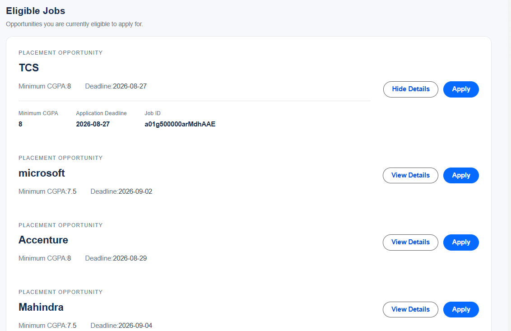
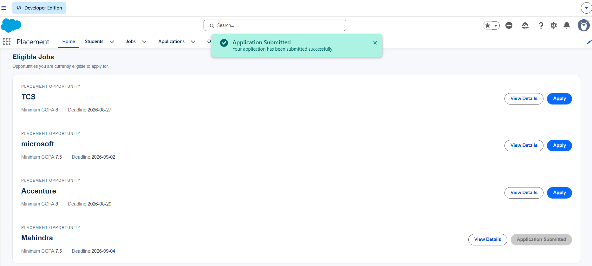
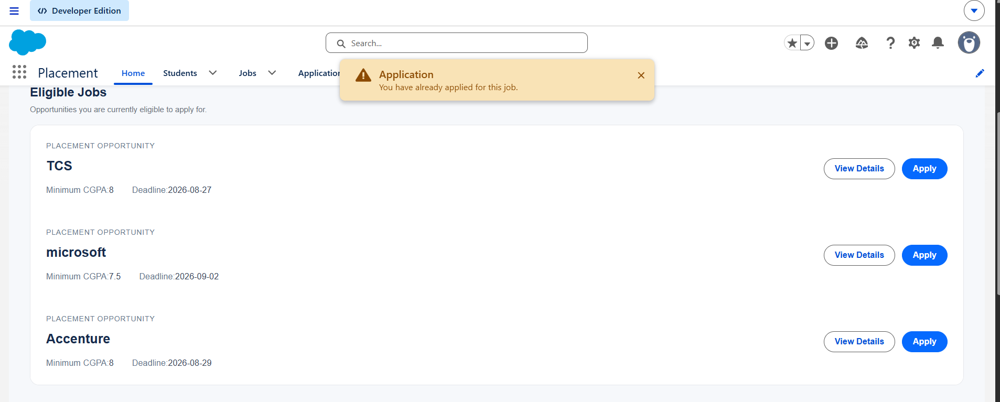
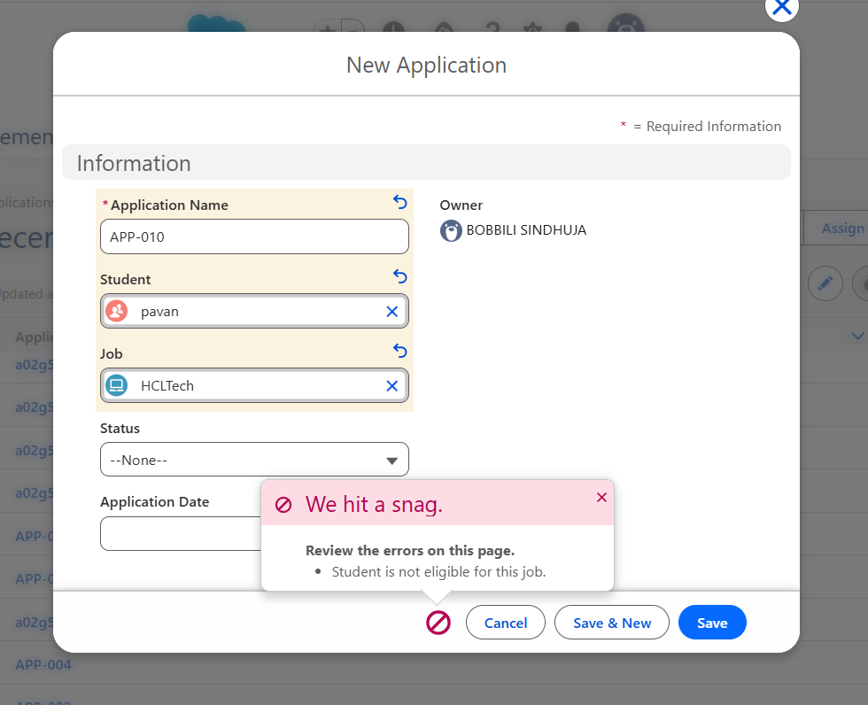
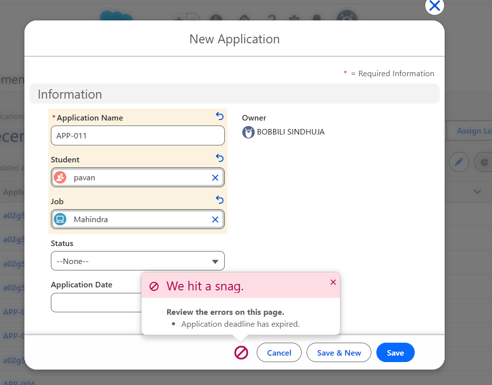
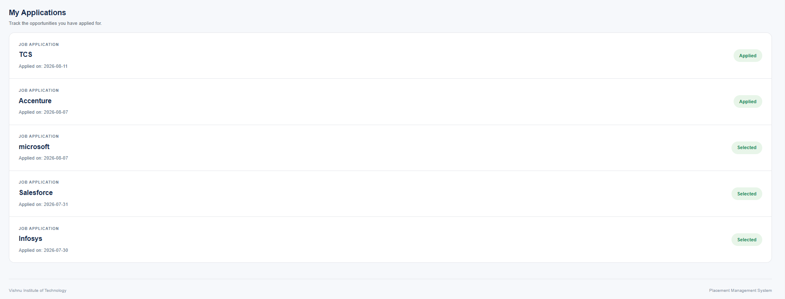

# Salesforce Interview Readiness Bootcamp – Day 10

## Project Overview

Day 10 focuses on building **User Experiences with Lightning Web Components (LWC)** for the Student Placement Management System.

The project connects the existing Salesforce backend with a student-facing Lightning Web Component, allowing students to view eligible jobs, view job details, apply for opportunities, and track their applications.

The UI handles user interaction while Apex and the Service Layer handle business logic and validation.

---

# Sprint Objectives

Successfully implemented the following engineering tasks:

- Build a student-facing Lightning Web Component
- Display eligible placement opportunities
- Create reusable Job Card components
- Connect LWC with Apex
- Implement job details and application actions
- Validate applications using server-side business rules
- Display submitted applications and status
- Handle loading, empty, success, and error states
- Connect the UI with the existing Service Layer
- Use real Salesforce data instead of hard-coded business data

---

# Business Scenario

Students should be able to interact with the Placement Management System without understanding the underlying Salesforce implementation.

The student should be able to:

- View eligible jobs
- View job details
- Apply for a job
- Receive application feedback
- View submitted applications
- Track application status

The LWC provides the user experience while the backend remains responsible for business decisions.

---

# Application Architecture

Student  
↓  
Lightning Web Component  
↓  
Apex Controller  
↓  
ApplicationService  
↓  
Salesforce Database

> The UI requests. The Business Layer decides.

---

# Application Workflow

Student Opens Portal  
↓  
View Eligible Jobs  
↓  
Select Job  
↓  
View Job Details  
↓  
Click Apply  
↓  
Apex Controller  
↓  
ApplicationService  
↓  
Validate Application  
↓  
Create Application  
↓  
Display Result  
↓  
My Applications Updated

---

# Implementation

## Eligible Jobs Component

Created the **Eligible Jobs** LWC to display placement opportunities.

Responsibilities:

- Retrieve eligible jobs
- Display job information
- Display multiple jobs
- Handle loading state
- Handle empty state
- Handle error state

The component uses real Salesforce `Job__c` data and applies the existing eligibility rules.

---

## Job Card Component

Created a reusable **Job Card** component.

Responsibilities:

- Display company information
- Display job details
- Display minimum CGPA
- Display deadline
- Provide View Details action
- Provide Apply action

---

## Application Workflow

The Apply action connects the LWC with the Apex backend.

LWC  
↓  
Apex Controller  
↓  
ApplicationService  
↓  
Retrieve Student  
↓  
Retrieve Job  
↓  
Check Duplicate  
↓  
Validate Eligibility  
↓  
Validate Deadline  
↓  
Create Application__c  
↓  
DML

---

## Application Validation

The application performs server-side validation before creating an application.

Validations include:

- Student eligibility
- Application deadline
- Duplicate application

This prevents invalid or duplicate applications from being inserted into Salesforce.

---

## My Applications

Implemented the **My Applications** functionality to display applications submitted by the student.

The component displays:

- Job
- Application Date
- Application Status

Application information is retrieved from Salesforce.

---

## Dashboard Statistics

Connected dashboard statistics with Salesforce data instead of permanently hard-coded values.

The dashboard provides information such as:

- Companies
- Open Jobs
- Applications
- Placement Status

---

# Testing

The application was tested using real Salesforce records.

## Eligible Jobs

- Total Jobs: **8**
- Open Jobs: **4**
- Student CGPA: **9.0**
- Eligible Jobs: **3**

Eligible jobs for the tested student:

- TCS
- Accenture
- microsoft

HCLTech is excluded because the minimum required CGPA is **9.3**, while the student's CGPA is **9.0**.

## Application Tests

| Test Case | Expected Result |
|---|---|
| Valid Application | Application Created |
| Duplicate Application | Application Rejected |
| CGPA Validation Failure | Application Rejected |
| Expired Job | Application Rejected |
| My Applications | Application Displayed |

---

# UI States

The LWC handles different application states:

- Loading State
- Success State
- Empty State
- Error State

This provides clear feedback to the student during different stages of the application.

---

# Project Screenshots

## Eligible Jobs

## Application Success

## Duplicate Application

## Eligibility Validation

## Deadline Validation

## My Applications

---

# Engineering Principles

This project follows clean Salesforce engineering principles:

- Keep business logic outside the UI
- Use Service classes for business rules
- Use real Salesforce data
- Create reusable UI components
- Use imperative Apex for explicit user actions
- Validate business rules before DML
- Handle loading, empty, success, and error states
- Keep components focused and maintainable
- Separate presentation from business logic

---

# Learning Outcomes

Through this project I learned:

- Lightning Web Components
- LWC Component Structure
- HTML Templates
- JavaScript in LWC
- Data Binding
- Reactive Properties
- Wire Service
- Imperative Apex
- Component Communication
- Custom Events
- Reusable Components
- Loading and Error Handling
- Connecting LWC with Apex
- Salesforce Service Layer Architecture

---

# Technologies Used

- Salesforce
- Lightning Web Components
- Apex
- SOQL
- DML
- HTML
- CSS
- JavaScript
- Salesforce Service Layer

---

# Key Achievement

Built a functional student-facing Salesforce Placement Portal using Lightning Web Components and connected it with Apex and the existing Service Layer to retrieve real job data, validate applications, create applications, and display application status.
