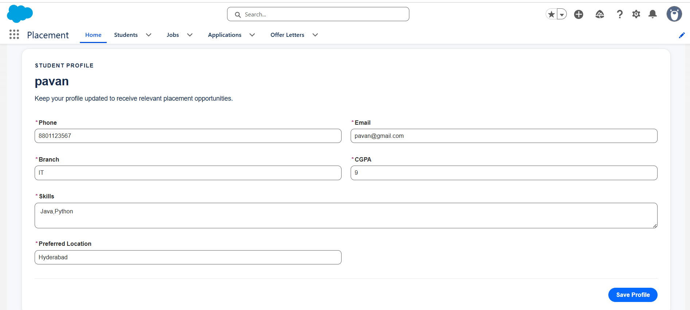
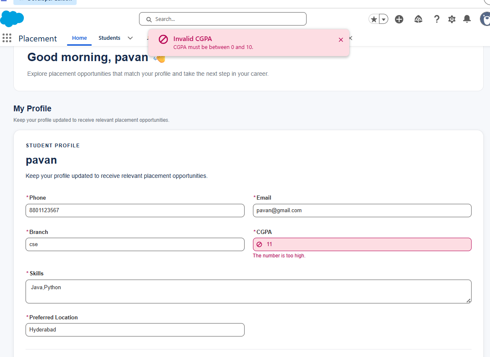
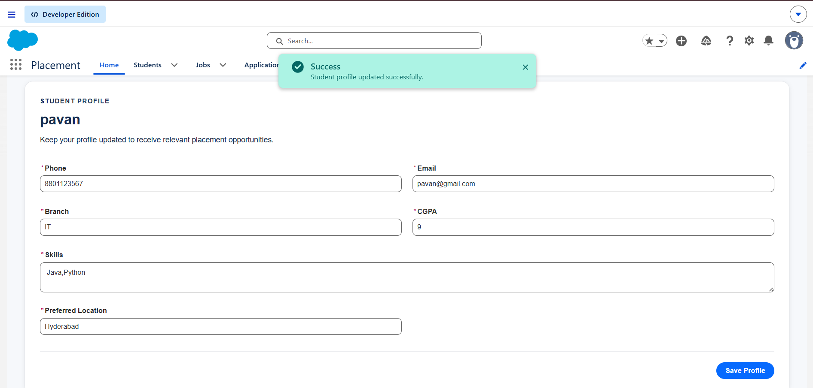
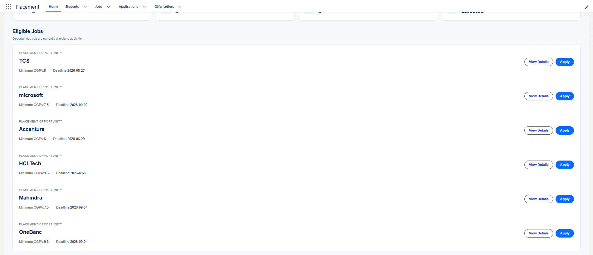
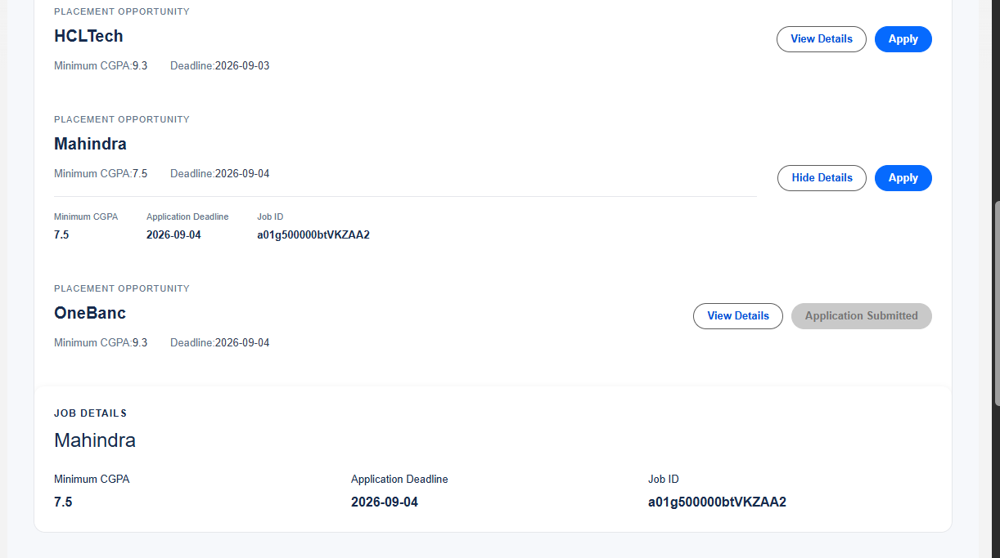
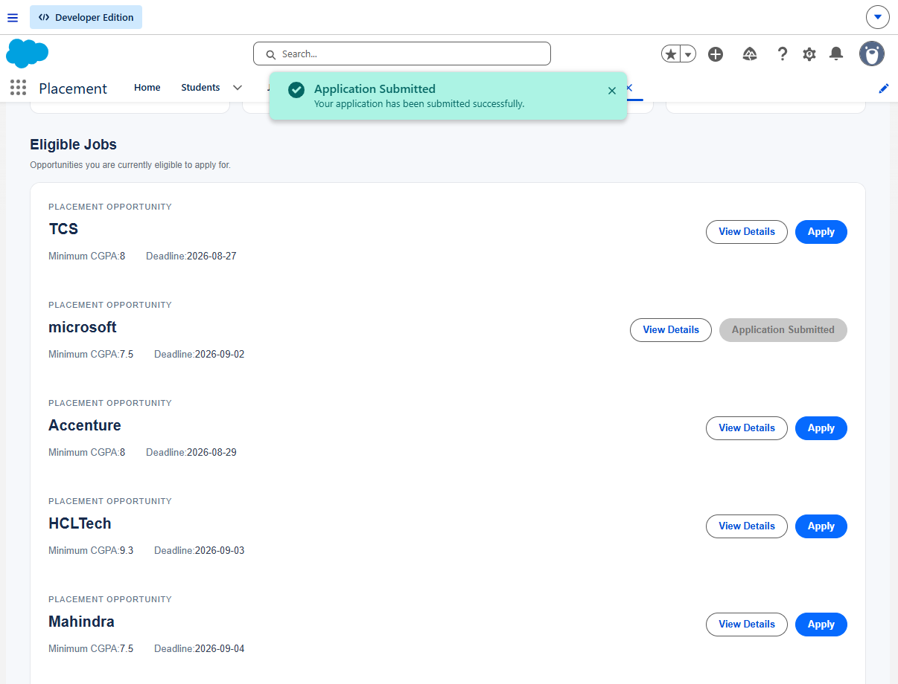
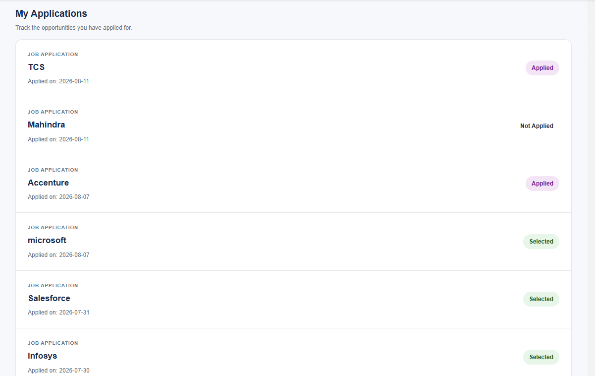
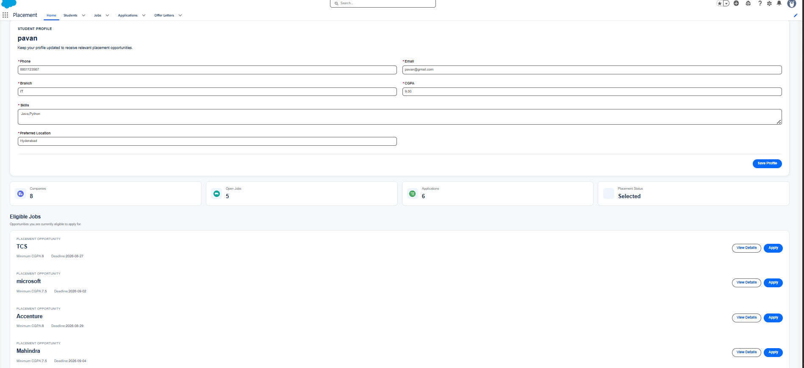
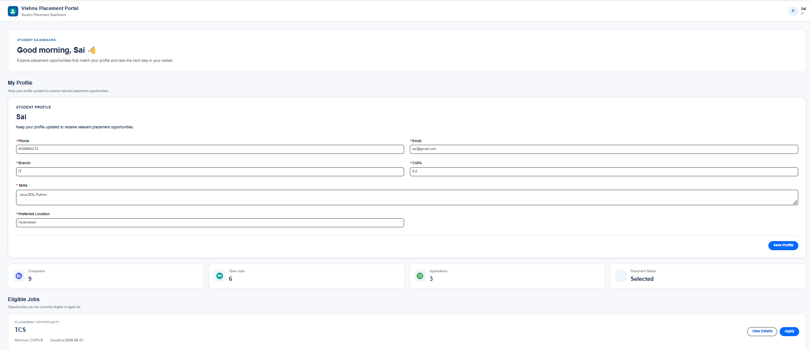

# Salesforce Interview Readiness Bootcamp – Day 11

## Project Overview

Day 10 focuses on building **Lightning Web Components that communicate, share data, and react to changes**.

The project demonstrates parent-child communication, custom events, reactive data refresh, Student Profile editing, reusable components, validation, and consistent UI states.

---

# Sprint Objectives

Successfully implemented the following:

- Build and edit Student Profile
- Validate profile information
- Save profile changes
- Display success and error feedback
- Implement parent-child communication
- Implement Custom Events
- Refresh Eligible Jobs after profile updates
- Create reusable StatusBadge component
- Create reusable EmptyState component
- Handle loading, empty, and error states
- Maintain clear component responsibilities

---

# Component Architecture

placementHome
│
├── studentProfile
│
├── eligibleJobs
│   ├── jobCard
│   ├── jobDetails
│   └── emptyState
│
├── My Applications
│   └── statusBadge
│
└── Student Summary

---

# Communication Flow

Student Profile
      │
      │ profileupdated
      ▼
placementHome
      │
      ▼
eligibleJobs.refreshJobs()
      │
      ▼
refreshApex()
      │
      ▼
Updated Eligible Jobs

---

# Student Profile

Implemented a reusable Student Profile component that:

- Loads existing student information
- Allows profile editing
- Validates required fields
- Validates CGPA and other inputs
- Saves changes to Salesforce
- Displays success feedback
- Displays meaningful errors

---

# Reactive Data

When the student's profile changes, dependent information is refreshed.

Example:

CGPA changes
     ↓
Student record updated
     ↓
Profile update event
     ↓
Eligible Jobs refresh
     ↓
Eligibility recalculated

This prevents the dashboard from displaying stale eligibility information.

---

# Component Communication

Implemented:

### Parent → Child

Using:

- @api
- Public methods

### Child → Parent

Using:

- CustomEvent
- Event detail

Example:

JobCard
   ↓
CustomEvent
   ↓
EligibleJobs

---

# Reusable Components

## StatusBadge

Created a reusable statusBadge component for displaying application statuses such as:

- Applied
- Shortlisted
- Interview Scheduled
- Selected
- Rejected

---

## EmptyState

Created a reusable emptyState component that accepts:

- Title
- Message
- Optional action label

Used for:

- No eligible jobs
- No applications

---

# Application Workflow

View Eligible Job
        ↓
View Details
        ↓
Apply
        ↓
Server-side Validation
        ↓
Application Created
        ↓
Success Message
        ↓
My Applications Refresh

---

# UI States

Implemented consistent handling for:

- Loading
- Editing
- Saving
- Success
- Error
- Empty states

---

#  Project Screenshots

## Student Profile

## Profile Validation

## Profile Update Success

## Eligible Jobs Reactive Refresh

## Job Details

## Application Success

## My Applications

## Student Dashboard – Pavan

## Student Dashboard – Sai

---

# Engineering Principles

- Keep component responsibilities clear
- Use @api for parent-to-child communication
- Use Custom Events for child-to-parent communication
- Keep server-side business validation authoritative
- Use reactive wired data where appropriate
- Reuse components when abstraction is justified
- Provide clear loading, success, error, and empty states
- Avoid unnecessary global state

---

# Learning Outcomes

Through this project I learned:

- Lightning Web Components
- Parent-Child Communication
- Custom Events
- Event detail
- @api
- Reactive Data
- refreshApex
- Lightning Data Service
- Student Profile Forms
- Client-side Validation
- Reusable Components
- Loading and Error States
- Empty State Design
- Component Architecture

---

# Key Achievement

Built a reactive Salesforce Placement Portal where Student Profile updates can refresh dependent Eligible Jobs, while reusable components and clear parent-child communication keep the application modular, maintainable, and consistent.
