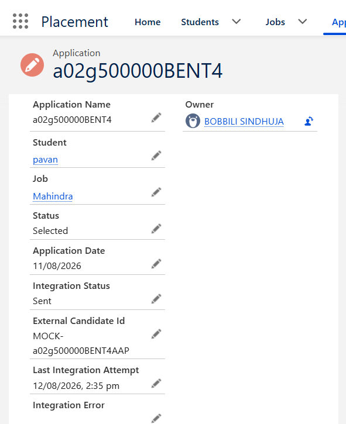
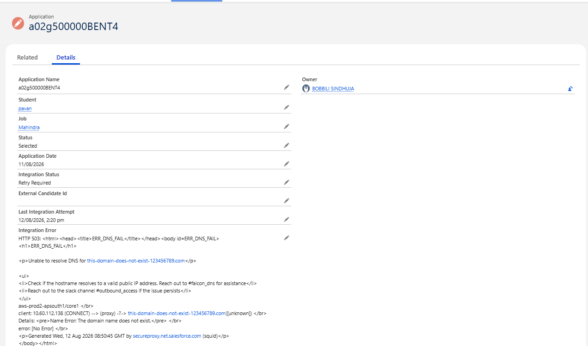
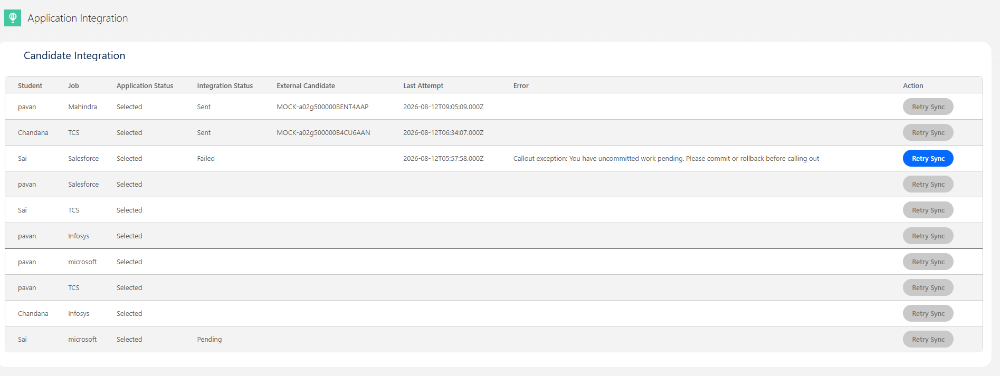
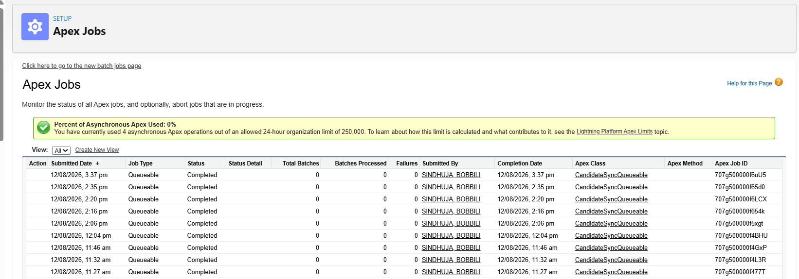
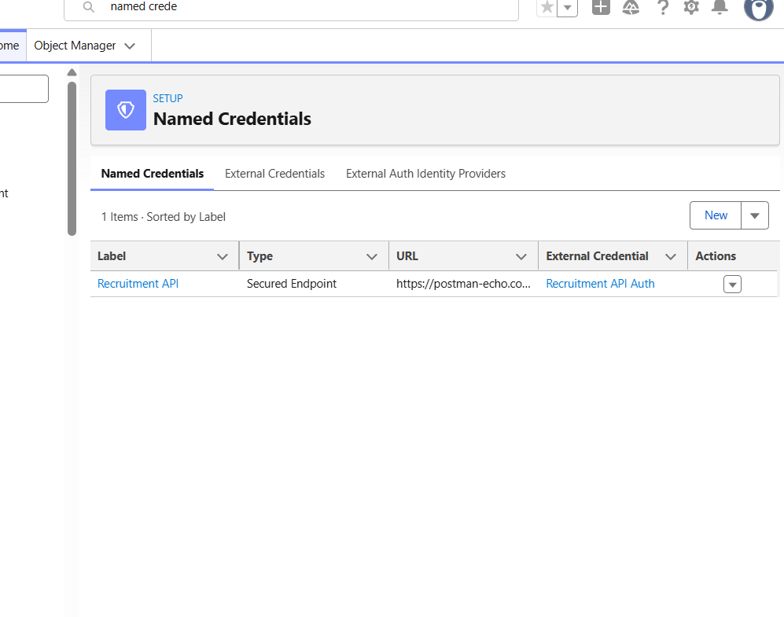

# Salesforce Interview Readiness Bootcamp – Day 12

## Project Overview

Day 12 focuses on building an **external recruitment integration** for the Placement Management System.

The project demonstrates asynchronous API integration, Queueable Apex, Named Credentials, integration status tracking, error handling, retry processing, and an administrator integration dashboard.

---

# Sprint Objectives

Successfully implemented the following:

- Integrate Salesforce with an external recruitment API
- Build candidate synchronization using Queueable Apex
- Configure Named Credential and External Credential
- Send selected candidate information to the external system
- Process API responses
- Track integration status
- Store external candidate ID
- Capture integration errors
- Support retry synchronization
- Build an administrator integration dashboard
- Monitor Queueable Apex execution

---

# Integration Architecture

Application
│
▼
ApplicationTrigger
│
▼
ApplicationService
│
▼
CandidateSyncQueueable
│
▼
Named Credential
│
▼
External Recruitment API
│
▼
Process Response
│
▼
Update Integration Status

---

# Candidate Synchronization

When an application is selected, candidate information is prepared for external synchronization.

The integration includes information such as:

- Student
- Email
- Branch
- CGPA
- Job
- Company
- Selection Date

---

# Queueable Apex

Implemented `CandidateSyncQueueable` to handle the external API call asynchronously.

Responsibilities include:

- Prepare candidate data
- Build HTTP request
- Perform REST API callout
- Process API response
- Update integration fields
- Handle integration errors

Using Queueable Apex keeps the external callout separate from the main Salesforce transaction.

---

# Secure API Integration

Configured Salesforce Named Credential and External Credential for the external recruitment API.

The integration flow is:

Named Credential
↓
Authentication
↓
External API
↓
Candidate Synchronization

Credentials are managed through Salesforce configuration instead of being hard-coded in Apex.

---

# Integration Status

The Application record tracks the external synchronization status.

Implemented fields include:

- Integration Status
- External Candidate Id
- Last Integration Attempt
- Integration Error

Example flow:

Pending
↓
Processing
↓
Sent

or

Pending
↓
Processing
↓
Failed
↓
Retry Sync
↓
Sent

---

# Error Handling

Tested external integration failures and captured the error against the Application record.

This allows administrators to identify:

- Failed integrations
- Error details
- Last integration attempt
- Records requiring retry

---

# Retry Synchronization

Implemented a `Retry Sync` action in the Application Integration interface.

Failed integrations can be retried without creating a new Application record.

This helps recover from temporary external API or connectivity failures.

---

# Application Integration Dashboard

Created an `applicationIntegration` Lightning Web Component to provide administrators with a centralized view of candidate synchronization.

The dashboard displays:

- Student
- Job
- Application Status
- Integration Status
- External Candidate
- Last Attempt
- Error
- Retry Sync

---

# Queueable Monitoring

Verified `CandidateSyncQueueable` executions through Salesforce Apex Jobs.

The jobs were successfully submitted and completed during testing.

---

# Project Screenshots

## Application Integration-Successful

## Failed Integration / Retry

## Application Integration Dashboard

## Queueable Apex Jobs

## Application Record – Integration Status

---

# Engineering Principles

- Use Queueable Apex for asynchronous callouts
- Keep external integration logic outside the Trigger
- Use Named Credentials for secure API authentication
- Separate business status from integration status
- Capture integration errors for troubleshooting
- Provide retry capability for failed integrations
- Maintain clear separation between Salesforce and external system responsibilities
- Provide administrator visibility into integration processing

---

# Learning Outcomes

Through this project I learned:

- Salesforce REST API Integration
- Queueable Apex
- HTTP Callouts
- Named Credentials
- External Credentials
- Asynchronous Processing
- API Request and Response Handling
- Integration Status Tracking
- Error Handling
- Retry Mechanisms
- LWC Integration Dashboard
- Apex Jobs Monitoring

---

# Key Achievement

Built an external recruitment integration for the Salesforce Placement Management System using **Queueable Apex and Named Credentials**, with integration status tracking, error handling, retry synchronization, and an administrator dashboard for monitoring candidate integrations.
