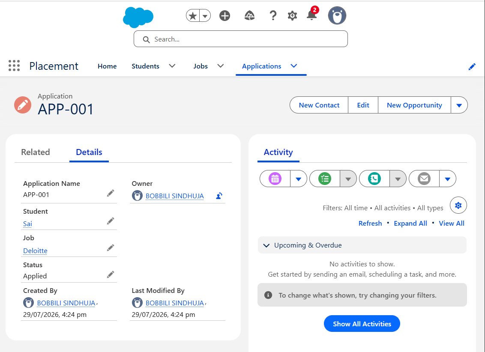
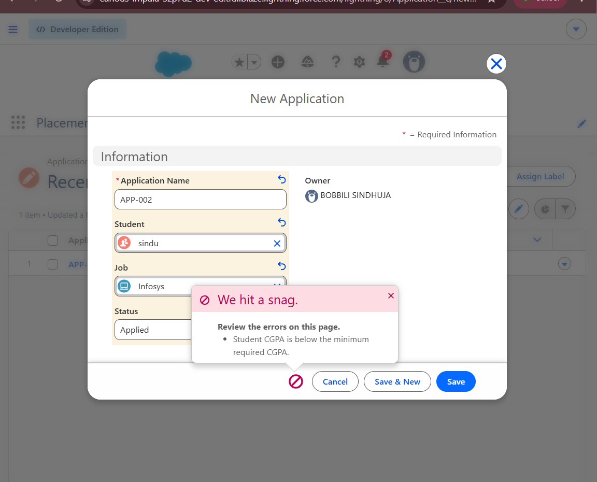
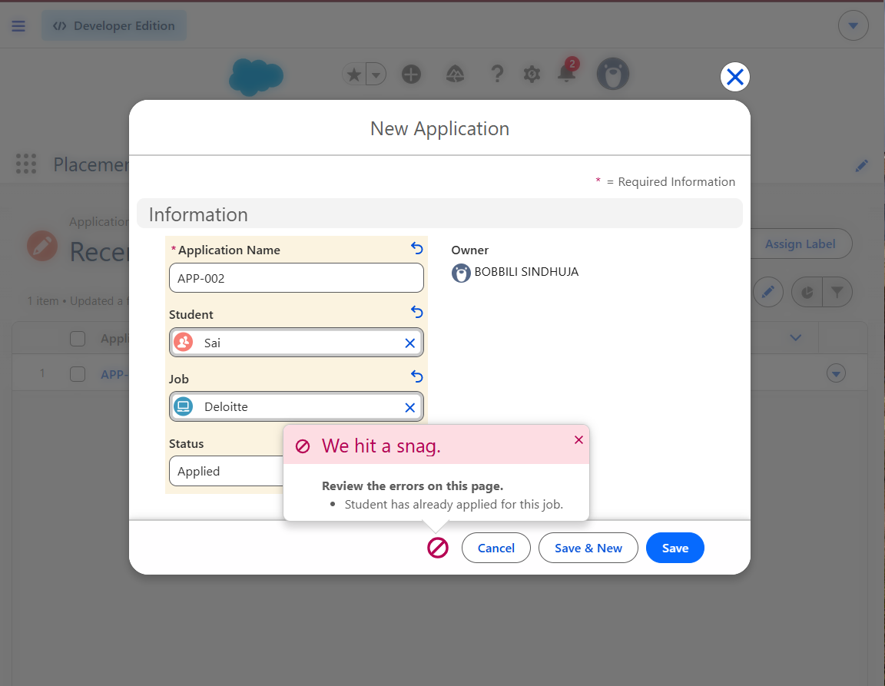
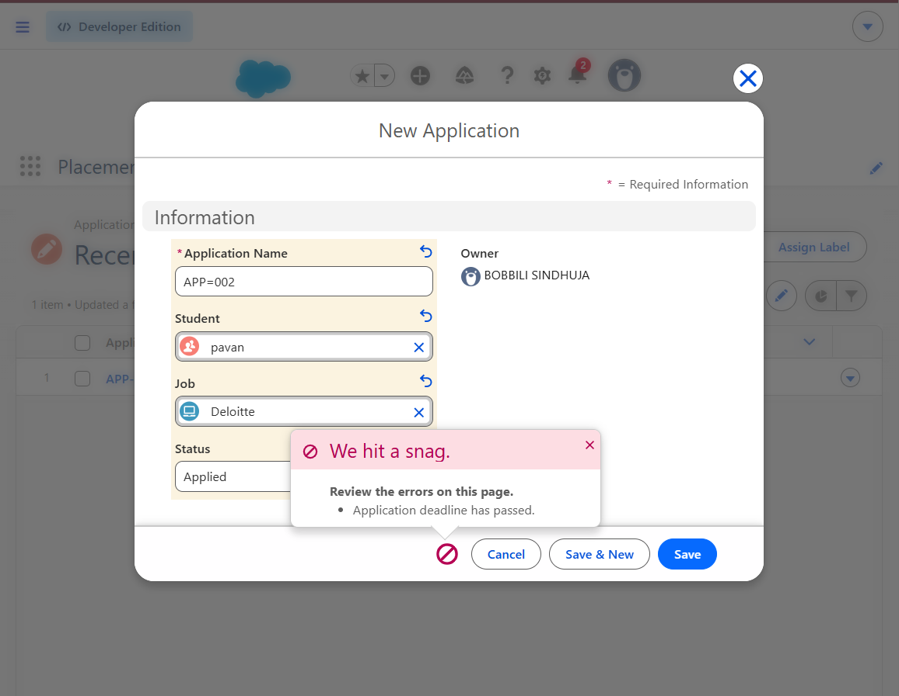

# 🚀 Salesforce Interview Readiness Bootcamp – Day 2 Assignment

## 📖 Overview

This project was developed as part of the **Salesforce Interview Readiness Bootcamp – Day 2 Assignment**.

The objective was to automate the student job application process using an **Apex Trigger** while following Salesforce best practices such as bulkification and governor limit optimization.

---

# 🎯 Objective

The trigger enforces the following business rules:

- Validate Student CGPA against the Job's Minimum CGPA.
- Prevent duplicate applications for the same job.
- Reject applications submitted after the job's last date.
- Automatically assign the default application status as **Applied**.
- Implement a bulkified solution without SOQL or DML statements inside loops.

---

# 🏗 Objects Used

## Student__c

| Field | Type |
|-------|------|
| Name | Text |
| CGPA__c | Number |

---

## Job__c

| Field | Type |
|-------|------|
| Name | Text |
| Minimum_CGPA__c | Number |
| Last_Date__c | Date |

---

## Application__c

| Field | Type |
|-------|------|
| Name | Text |
| Student__c | Lookup(Student__c) |
| Job__c | Lookup(Job__c) |
| Status__c | Picklist |

---

# ⚡ Apex Trigger

**Trigger Name:** `ApplicationTrigger`

**Trigger Type:** `Before Insert`

---

# 🤔 Why Apex Trigger?

An Apex Trigger was used because the validation requires checking data across multiple related objects (Student, Job, and Application) before saving the record.

The trigger also automatically assigns the default Status field.

---

# 🤔 Why Before Insert?

A **Before Insert Trigger** allows Salesforce to:

- Validate records before they are saved.
- Prevent invalid records from being inserted.
- Automatically populate the Status field.
- Avoid additional DML operations, improving performance.

---

# 🚀 Bulkification

The trigger follows Salesforce Bulkification best practices:

- Used **Set<Id>** to collect unique Student IDs.
- Used **Set<Id>** to collect unique Job IDs.
- Queried Student records only once.
- Queried Job records only once.
- Queried existing Application records only once.
- Used **Map<Id, Student__c>** for efficient Student lookup.
- Used **Map<Id, Job__c>** for efficient Job lookup.
- Used **Set<String>** to detect duplicate Student–Job combinations.
- No SOQL queries inside loops.
- No DML statements inside loops.

---

# 📚 Collections Used

### List

Stores existing Application records retrieved from Salesforce.

### Set

Used for:

- Unique Student IDs
- Unique Job IDs
- Duplicate Student–Job combinations

### Map

Used for:

- Student lookup
- Job lookup

---

# 🧪 Test Cases

| Test Case | Expected Result | Status |
|-----------|-----------------|--------|
| Valid Application | Record inserted successfully | ✅ Passed |
| Low CGPA Validation | Error displayed | ✅ Passed |
| Duplicate Application Validation | Error displayed | ✅ Passed |
| Last Date Validation | Error displayed | ✅ Passed |

---

# 📸 Test Results

## ✅ Test Case 1 – Valid Application



---

## ❌ Test Case 2 – Low CGPA Validation



---

## ❌ Test Case 3 – Duplicate Application Validation



---

## ❌ Test Case 4 – Last Date Validation



---

# 📂 Repository Structure

```text
Salesforce-Bootcamp
│
├── ApplicationTrigger.apex
├── README.md
└── Screenshots
    ├── 01_Valid_Application.png
    ├── 02_Low_CGPA_Error.png
    ├── 03_Duplicate_Application_Error.png
    └── 04_Last_Date_Error.png
```

---

# 🎓 Learning Outcomes

During this assignment, I learned:

- Apex Triggers
- Before Insert Trigger
- Trigger Context Variables
- SOQL Queries
- Governor Limits
- Bulkification
- Lists, Sets, and Maps
- Cross-object Validation
- Duplicate Record Prevention
- Using `addError()` for meaningful validation messages

---

# 👨‍💻 Author

**Darsiguntla Venkata Sai Kumar**

B.Tech – Information Technology

Aspiring Salesforce Developer
