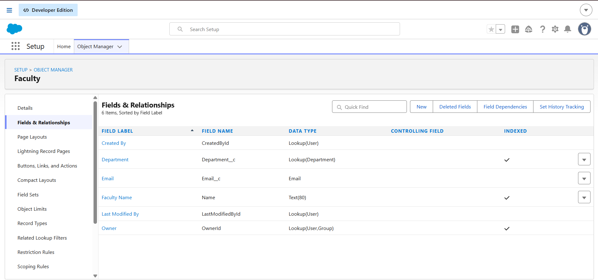
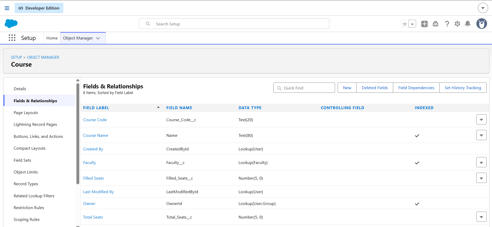

# Data Model

## Introduction

The first step in building the College Management System was designing the data model.

A good data model is the foundation of every enterprise application because it defines how information is stored, connected, and managed.

The system was designed using Salesforce Custom Objects, Custom Fields, and Lookup Relationships.

---

# Step 1: Student Object Creation

## Purpose

The Student object stores information related to students enrolled in the college.

## Object Details

| Property    | Value        |
| ----------- | ------------ |
| Object Name | Student      |
| Record Name | Student Name |
| Data Type   | Text         |

## Fields Created

| Field Name   | Data Type          | Purpose                        |
| ------------ | ------------------ | ------------------------------ |
| Student Name | Text               | Stores student name            |
| Student ID   | Auto Number        | Generates unique student ID    |
| Email        | Email              | Stores student email           |
| Phone        | Phone              | Stores contact number          |
| Attendance   | Percent            | Tracks attendance percentage   |
| Department   | Lookup(Department) | Connects student to department |

## Screenshot

## Explanation

The Student object acts as the central entity of the system. Every student record contains identification details, communication information, attendance information, and department mapping.

---

# Step 2: Faculty Object Creation

## Purpose

The Faculty object stores information about teaching staff.

## Object Details

| Property    | Value        |
| ----------- | ------------ |
| Object Name | Faculty      |
| Record Name | Faculty Name |
| Data Type   | Text         |

## Fields Created

| Field Name   | Data Type          | Purpose                        |
| ------------ | ------------------ | ------------------------------ |
| Faculty Name | Text               | Stores faculty name            |
| Email        | Email              | Stores faculty email           |
| Department   | Lookup(Department) | Connects faculty to department |

## Screenshot

## Explanation

Faculty records are linked with departments and courses. This enables course assignment and departmental organization.

---

# Step 3: Course Object Creation

## Purpose

The Course object stores course information and seat management details.

## Object Details

| Property    | Value       |
| ----------- | ----------- |
| Object Name | Course      |
| Record Name | Course Name |
| Data Type   | Text        |

## Fields Created

| Field Name   | Data Type       | Purpose                   |
| ------------ | --------------- | ------------------------- |
| Course Name  | Text            | Stores course title       |
| Course Code  | Text            | Unique course identifier  |
| Faculty      | Lookup(Faculty) | Assigns faculty to course |
| Total Seats  | Number          | Maximum course capacity   |
| Filled Seats | Number          | Tracks enrolled students  |

## Screenshot

## Explanation

The Course object manages course allocation and enrollment capacity. It also connects faculty members with specific courses.

---

# Step 4: Department Object Creation

## Purpose

The Department object represents academic departments.

## Fields Created

| Field Name      | Data Type |
| --------------- | --------- |
| Department Name | Text      |
| Department Code | Text      |

## Explanation

Departments provide organizational structure and allow both students and faculty members to be grouped logically.

---

# Step 5: Registration Object Creation

## Purpose

The Registration object manages course enrollment.

## Fields Created

| Field Name        | Data Type       |
| ----------------- | --------------- |
| Student           | Lookup(Student) |
| Course            | Lookup(Course)  |
| Registration Date | Date            |
| Status            | Picklist        |

## Picklist Values

* Pending
* Approved
* Rejected

## Explanation

The Registration object creates the relationship between students and courses.

---

# Lookup Relationships Implemented

The following lookup relationships were created:

Department
├── Student
├── Faculty

Faculty
├── Course

Student
├── Registration

Course
├── Registration

## Benefits

* Eliminates data duplication
* Maintains data consistency
* Supports scalable architecture
* Enables enterprise reporting

---

# Sample Data Created

Department:

* Information Technology

Faculty:

* Sandeep Kumar

Student:

* Sindhuja

Course:

* Salesforce Fundamentals

Registration:

* Student enrolled in Salesforce Fundamentals

---

# Learning Outcome

Through data modeling, I learned how Salesforce uses objects, fields, and relationships to organize business data efficiently.

This step established the foundation required for validation rules, formula fields, automation, Apex programming, and Lightning Web Components used later in the project.
