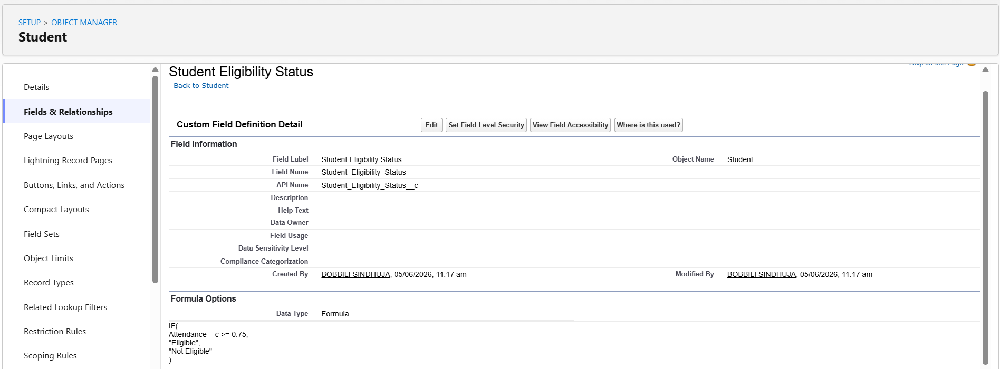

# Formula Fields

## Introduction

Formula Fields are Salesforce fields that automatically calculate values using formulas instead of storing data manually.

They help reduce manual work, improve data accuracy, and ensure consistency across records.

In this project, formula fields were used to automate seat calculation, attendance monitoring, and eligibility determination.

---

# Formula Field 1: Remaining Seats

## Object

Course

## Purpose

The Remaining Seats field automatically calculates how many seats are still available in a course.

This prevents administrators from manually calculating seat availability.

---

## Creation Steps

1. Open Object Manager.
2. Select Course Object.
3. Open Fields & Relationships.
4. Click New.
5. Select Formula.
6. Field Label:

```text
Remaining Seats
```

7. Return Type:

```text
Number
```

8. Enter Formula:

```text
Total_Seats__c - Filled_Seats__c
```

9. Save the field.

---

## Example

| Total Seats | Filled Seats | Remaining Seats |
| ----------- | ------------ | --------------- |
| 60          | 20           | 40              |
| 50          | 35           | 15              |
| 100         | 100          | 0               |

---

## Screenshot


---

## Business Value

* Prevents manual calculations.
* Shows seat availability instantly.
* Supports registration decisions.
* Improves operational efficiency.

---

# Formula Field 2: Attendance Status

## Object

Student

## Purpose

The Attendance Status field automatically indicates whether a student has low attendance or is in good standing.

---

## Creation Steps

1. Open Student Object.
2. Open Fields & Relationships.
3. Click New.
4. Select Formula.
5. Field Label:

```text
Attendance Status
```

6. Return Type:

```text
Text
```

7. Enter Formula:

```text
IF(
Attendance__c < 0.75,
"Low Attendance",
"Good Standing"
)
```

8. Save.

---

## Test Results

| Attendance | Result         |
| ---------- | -------------- |
| 60%        | Low Attendance |
| 70%        | Low Attendance |
| 90%        | Good Standing  |

---

## Screenshot


---

## Business Value

* Automatically identifies attendance issues.
* Helps faculty monitor student participation.
* Reduces manual review effort.

---

# Formula Field 3: Student Eligibility Status

## Object

Student

## Purpose

This field determines whether a student is eligible based on attendance percentage.

---

## Creation Steps

1. Open Student Object.
2. Click New Formula Field.
3. Field Label:

```text
Student Eligibility Status
```

4. Return Type:

```text
Text
```

5. Formula:

```text
IF(
Attendance__c >= 0.75,
"Eligible",
"Not Eligible"
)
```

6. Save.

---

## Test Results

| Attendance | Eligibility  |
| ---------- | ------------ |
| 60%        | Not Eligible |
| 70%        | Not Eligible |
| 90%        | Eligible     |

---

## Screenshot



---

## Business Value

* Automates eligibility checks.
* Supports academic decision making.
* Can be reused in Flows and Apex logic.

---

# Formula Field 4: Course Full Status

## Object

Course

## Purpose

Automatically identifies whether a course has reached capacity.

---

## Formula

```text
IF(
Remaining_Seats__c = 0,
"Full",
"Available"
)
```

---

## Example

| Remaining Seats | Result    |
| --------------- | --------- |
| 0               | Full      |
| 10              | Available |

---

## Screenshot


---

## Business Value

* Indicates course availability instantly.
* Prevents overbooking.
* Supports automated notifications and triggers.

---

# Formula Field Testing

The following tests were performed:

### Test 1

Attendance = 60%

Result:

```text
Low Attendance
Not Eligible
```

---

### Test 2

Attendance = 90%

Result:

```text
Good Standing
Eligible
```

---

### Test 3

Total Seats = 60

Filled Seats = 20

Result:

```text
Remaining Seats = 40
```

---

# Learning Outcome

Through Formula Fields, I learned how Salesforce can automatically calculate values and provide real-time business insights without requiring Apex code or manual calculations.

Formula Fields improve data accuracy, reduce human error, and support enterprise automation.
