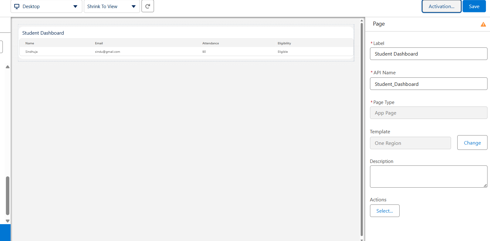

# Lightning Web Component (LWC)

## Introduction

Lightning Web Components (LWC) is Salesforce's modern framework for building user interfaces.

LWC provides:

- Faster performance
- Reusable components
- Better user experience
- Integration with Apex

In this project, a Student Dashboard component was developed to display student information dynamically.

---

# Component Overview

## Component Name

```text
studentDashboard
```

## Purpose

Display student information in a user-friendly dashboard.

The component retrieves student records from Salesforce using an Apex Controller and displays them on a Lightning App Page.

---

# Business Requirement

Administrators need a quick way to view student information.

Instead of navigating through multiple records, the dashboard provides a consolidated view of:

- Student Name
- Email
- Attendance
- Eligibility Status

---

# System Architecture

```text
Student Records
        ↓
StudentController (Apex)
        ↓
Lightning Web Component
        ↓
Student Dashboard
        ↓
User Interface
```

---

# Component Files

The component consists of three files:

```text
studentDashboard.html
studentDashboard.js
studentDashboard.js-meta.xml
```

---

# HTML File

## Purpose

Responsible for displaying information on the page.

### Features

- Dashboard Header
- Student Data Display
- Dynamic Rendering

---

# JavaScript File

## Purpose

Handles communication with Apex.

### Responsibilities

- Call Apex Method
- Retrieve Student Records
- Store Data
- Display Data

---

# Meta XML File

## Purpose

Expose the component to Salesforce.

### Targets

```xml
<target>lightning__AppPage</target>
```

This allows the component to be placed inside Lightning App Builder.

---

# Apex Integration

The component communicates with:

```text
StudentController
```

Method Used:

```apex
getStudents()
```

---

# Data Displayed

| Field | Description |
|---------|---------|
| Name | Student Name |
| Email | Student Email |
| Attendance | Attendance Percentage |
| Eligibility Status | Eligible / Not Eligible |

---

# Dashboard Testing

## Test Case 1

### Input

Student Record:

| Name | Attendance |
|--------|------------|
| Sindhuja | 90% |

---

### Expected Result

Dashboard displays:

```text
Sindhuja
90%
Eligible
```

---

### Actual Result

Dashboard displayed information successfully.

---

### Status

✅ Passed

---

# Lightning Page Deployment

The component was deployed to:

```text
Lightning App Builder
```

Page Type:

```text
App Page
```

Layout:

```text
One Region
```

---

# Screenshot 

Lightning App Builder



---

# Benefits

The dashboard provides:

- Quick access to student data
- Better user experience
- Dynamic record display
- Apex integration
- Reusable architecture

---

# Learning Outcome

Through Lightning Web Components, I learned:

- Component-based development
- Apex integration
- Dynamic data rendering
- Salesforce UI customization
- Modern frontend development

LWC is one of the most important technologies in Salesforce development.

---

# Conclusion

The Student Dashboard successfully displays student information using Salesforce Lightning Web Components and Apex.

This implementation demonstrates how Salesforce combines frontend and backend technologies to build modern enterprise applications.
