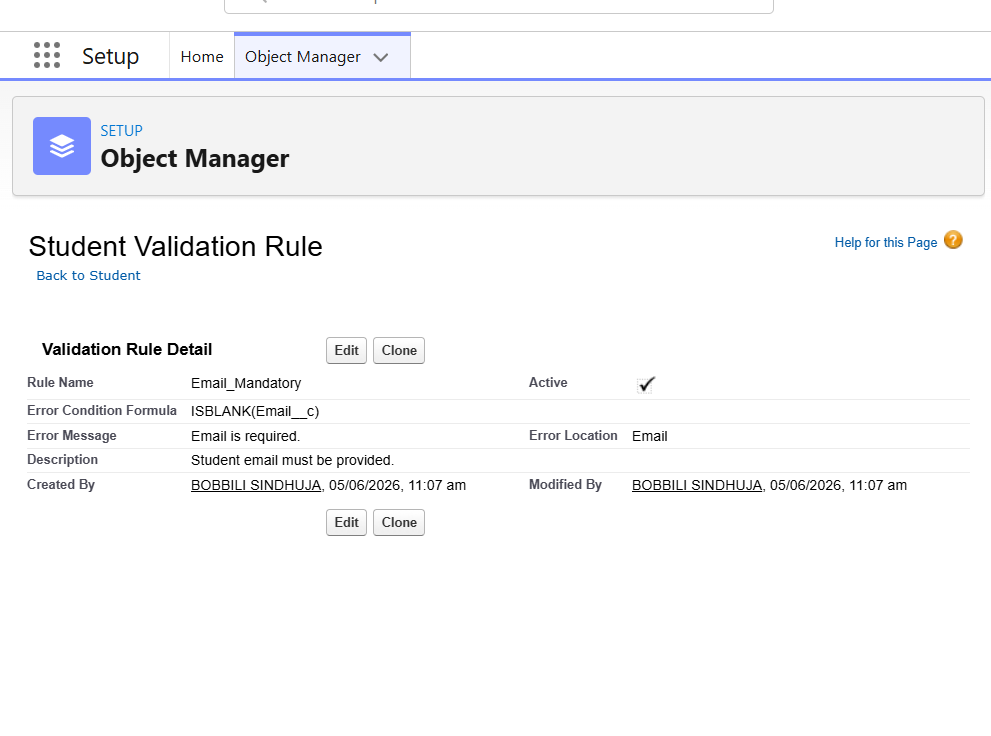
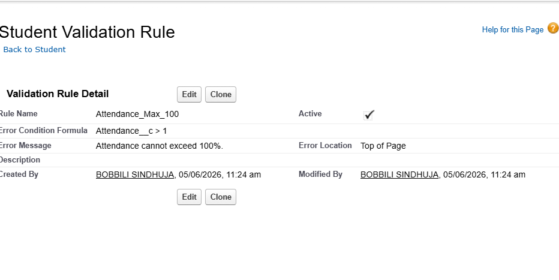
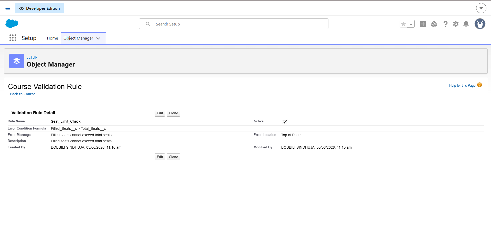
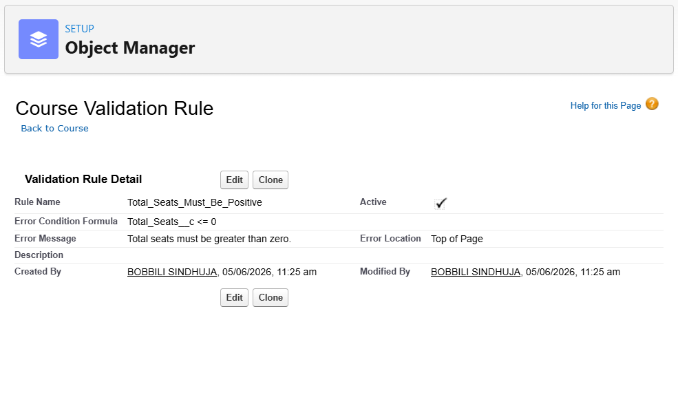
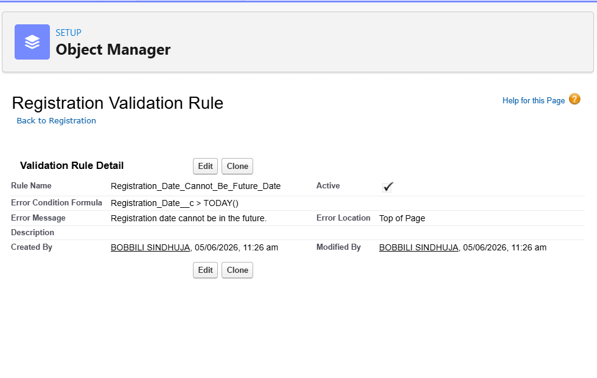

# Validation Rules

## Introduction

Validation Rules are used to maintain data quality and enforce business requirements within Salesforce.

They prevent users from entering invalid data and ensure that records follow predefined business policies before being saved.

In the College Management System project, validation rules were implemented to control attendance values, course capacity, registration dates, and mandatory student information.

---

# Validation Rule 1: Email Mandatory

## Object

Student

## Business Requirement

Every student must provide an email address.

Without an email address:

- Communication becomes difficult.
- Student records become incomplete.
- Notifications cannot be delivered.

---

## Validation Rule Details

### Rule Name

```text
Email_Mandatory
```

### Formula

```salesforce
ISBLANK(Email__c)
```

### Error Message

```text
Email is required.
```

---

## Implementation Steps

1. Open Object Manager.
2. Select Student Object.
3. Open Validation Rules.
4. Click New.
5. Enter Rule Name.
6. Enter Formula.
7. Enter Error Message.
8. Save and Activate.

---

## Screenshot



---

## Test Case

### Input

Student record without email.

### Expected Result

Validation error displayed.

### Actual Result

Validation error displayed successfully.

### Status

✅ Passed

---

# Validation Rule 2: Attendance Cannot Exceed 100%

## Object

Student

## Business Requirement

Attendance percentage cannot exceed 100%.

Values above 100% are logically impossible and would create inaccurate reports.

---

## Validation Rule Details

### Rule Name

```text
Attendance_Max_100
```

### Formula

```salesforce
Attendance__c > 1
```

### Error Message

```text
Attendance cannot exceed 100%.
```

---

## Screenshot



---

## Test Case

### Input

```text
Attendance = 120%
```

### Expected Result

Validation error displayed.

### Actual Result

Validation error displayed successfully.

### Status

✅ Passed

---

# Validation Rule 3: Seat Limit Check

## Object

Course

## Business Requirement

Filled seats should never exceed total available seats.

This prevents overbooking of courses.

---

## Validation Rule Details

### Rule Name

```text
Seat_Limit_Check
```

### Formula

```salesforce
Filled_Seats__c > Total_Seats__c
```

### Error Message

```text
Filled seats cannot exceed total seats.
```

---

## Screenshot



---

## Test Case

### Input

```text
Total Seats = 50
Filled Seats = 55
```

### Expected Result

Validation error displayed.

### Actual Result

Validation error displayed successfully.

### Status

✅ Passed

---

# Validation Rule 4: Total Seats Must Be Positive

## Object

Course

## Business Requirement

A course cannot be created with zero or negative seats.

Every course must have at least one available seat.

---

## Validation Rule Details

### Rule Name

```text
Total_Seats_Must_Be_Positive
```

### Formula

```salesforce
Total_Seats__c <= 0
```

### Error Message

```text
Total seats must be greater than zero.
```

---

## Screenshot



---

## Test Case

### Input

```text
Total Seats = 0
```

### Expected Result

Validation error displayed.

### Actual Result

Validation error displayed successfully.

### Status

✅ Passed

---

# Validation Rule 5: Registration Date Cannot Be Future Date

## Object

Registration

## Business Requirement

Students cannot register using future dates.

Registration dates must represent actual registration activity.

---

## Validation Rule Details

### Rule Name

```text
Registration_Date_Cannot_Be_Future_Date
```

### Formula

```salesforce
Registration_Date__c > TODAY()
```

### Error Message

```text
Registration date cannot be in the future.
```

---

## Screenshot



---

## Test Case

### Input

Future date selected.

### Expected Result

Validation error displayed.

### Actual Result

Validation error displayed successfully.

### Status

✅ Passed

---

# Validation Rule Testing Summary

| Validation Rule | Result |
|----------------|---------|
| Email Mandatory | Passed |
| Attendance Max 100 | Passed |
| Seat Limit Check | Passed |
| Total Seats Must Be Positive | Passed |
| Registration Date Cannot Be Future Date | Passed |

---

# Business Benefits

The implemented validation rules provide:

- Improved data quality
- Prevention of invalid records
- Accurate reporting
- Better enrollment management
- Consistent student information

---

# Learning Outcome

Through Validation Rules, I learned how Salesforce enforces business policies at the data entry level without writing code.

Validation Rules help maintain database integrity and ensure that only valid information is stored in the system.

This significantly improves the reliability and accuracy of enterprise applications.
