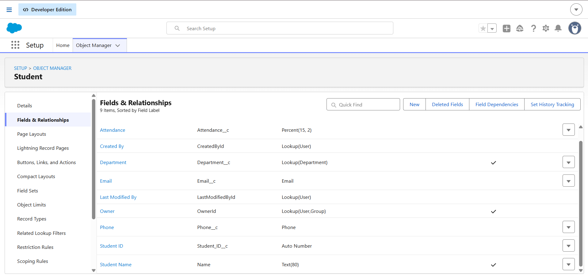
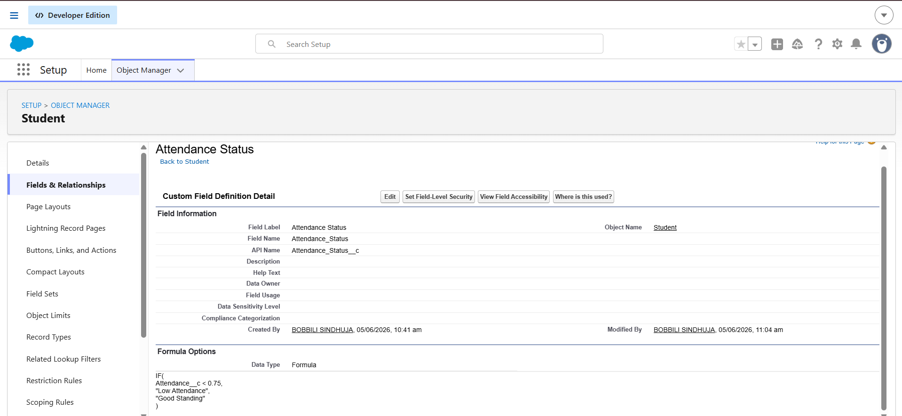

# Enterprise Application Architecture

# College Management System

## Introduction

The College Management System is a Salesforce-based enterprise application designed to manage students, faculty, departments, courses, and registrations.

The application combines Salesforce declarative and programmatic development tools to automate business processes, maintain data quality, and provide a modern user experience.

This architecture demonstrates how enterprise applications are structured using multiple layers that work together to deliver business functionality.

---

# System Overview

The system manages:

* Student Information
* Faculty Information
* Department Information
* Course Management
* Student Registrations
* Automated Approvals
* Course Enrollment Tracking
* Dashboard Reporting

The application follows a layered architecture model commonly used in enterprise software systems.

---

# High-Level Architecture

```text
+----------------------------------+
|      Lightning Web Component     |
|        Student Dashboard         |
+----------------------------------+
                 |
                 v
+----------------------------------+
|          Apex Controller         |
|        StudentController         |
+----------------------------------+
                 |
                 v
+----------------------------------+
|      Flow Automation Layer       |
| Registration Approval Flow       |
| Course Seat Update Flow          |
+----------------------------------+
                 |
                 v
+----------------------------------+
|      Business Rule Layer         |
| Validation Rules                 |
| Formula Fields                   |
+----------------------------------+
                 |
                 v
+----------------------------------+
|      Salesforce Data Layer       |
| Objects & Relationships          |
+----------------------------------+
```

---

# Object Architecture

The application is built using five primary custom objects.

## Department

Purpose:

Stores department information.

Fields:

* Department Name
* Department Code

---

## Faculty

Purpose:

Stores faculty information.

Fields:

* Faculty Name
* Email
* Department

---

## Student

Purpose:

Stores student details.

Fields:

* Student Name
* Student ID
* Email
* Phone
* Attendance
* Department

---

## Course

Purpose:

Stores course information.

Fields:

* Course Name
* Course Code
* Total Seats
* Filled Seats
* Faculty

---

## Registration

Purpose:

Manages student course registrations.

Fields:

* Student
* Course
* Registration Date
* Status

---

# Screenshot

Add object architecture screenshots:




---

# Relationship Architecture

The system uses Lookup Relationships to connect business entities.

```text
Department
├── Student
├── Faculty

Faculty
├── Course

Student
├── Registration

Course
├── Registration
```

---

# Why Relationships Are Important

Relationships provide:

* Data consistency
* Reduced duplication
* Better reporting
* Scalable architecture
* Easier maintenance

---

# Validation Architecture

Validation Rules enforce business policies.

Implemented Rules:

1. Email Mandatory
2. Attendance Maximum 100%
3. Seat Limit Check
4. Total Seats Must Be Positive
5. Registration Date Cannot Be Future Date

Purpose:

* Prevent invalid data
* Improve data quality
* Enforce business standards

---

# Screenshot


---

# Formula Architecture

Formula Fields automate calculations.

Implemented Formula Fields:

## Remaining Seats

```text
Total Seats - Filled Seats
```

Purpose:

Automatically calculates available seats.

---

## Attendance Status

```text
Low Attendance / Good Standing
```

Purpose:

Monitors student attendance.

---

## Student Eligibility Status

```text
Eligible / Not Eligible
```

Purpose:

Determines student eligibility.

---

## Course Full Status

```text
Full / Available
```

Purpose:

Indicates course availability.

---

# Screenshot



---

# Automation Architecture

The system uses Salesforce Flow Builder to automate business processes.

## Flow 1

Registration Auto Approval

Purpose:

Automatically approve student registrations.

---

## Flow 2

Course Seat Update Flow

Purpose:

Automatically update course enrollment count.

---

# Flow Architecture

```text
Registration Created
        ↓
Validation Rules
        ↓
Registration Auto Approval
        ↓
Course Seat Update
        ↓
Database Updated
```

---

# Screenshot


---

# Apex Architecture

The application uses Apex to implement backend business logic.

## Apex Class

StudentController

Responsibilities:

* Retrieve student records
* Execute SOQL queries
* Provide data to LWC

---

## Apex Trigger

CourseTrigger

Responsibilities:

* Monitor course capacity
* Detect full courses
* Execute event-driven logic

---

# Screenshot


---

# User Interface Architecture

The frontend layer is built using Lightning Web Components.

## Component

Student Dashboard

Features:

* Student Name
* Email
* Attendance
* Eligibility Status

The dashboard retrieves data dynamically through Apex.

---

# UI Architecture

```text
Student Records
        ↓
StudentController
        ↓
Lightning Web Component
        ↓
Student Dashboard
```

---

# Screenshot


---

# Security Considerations

Enterprise applications require security controls.

Implemented Concepts:

* Salesforce Role-Based Access
* Object-Level Security
* Field-Level Security
* Record Access Control

Benefits:

* Protect sensitive information
* Prevent unauthorized access
* Improve compliance

---

# Scalability Considerations

If 100,000 users use this application:

Potential Challenges:

* Slow SOQL Queries
* Large Data Volumes
* Dashboard Performance
* Automation Limits
* Duplicate Data

Possible Solutions:

* Indexed Fields
* Optimized Queries
* Bulkified Apex
* Archiving Old Records
* Monitoring Automation Usage

---

# Enterprise Benefits

This architecture provides:

* Scalability
* Maintainability
* Reliability
* Automation
* Reusability
* Better User Experience

---

# Learning Outcome

Through this architecture design, I learned how enterprise Salesforce applications combine:

* Data Modeling
* Validation
* Automation
* Apex Development
* Event Processing
* User Interface Design

to create a complete business solution.

The project demonstrates how multiple Salesforce technologies interact together to solve real-world business problems.

---

# Conclusion

The College Management System follows a layered enterprise architecture that separates data, automation, business logic, and presentation layers.

This architecture improves maintainability, scalability, and long-term application reliability while demonstrating enterprise application design principles used in real-world Salesforce implementations.
