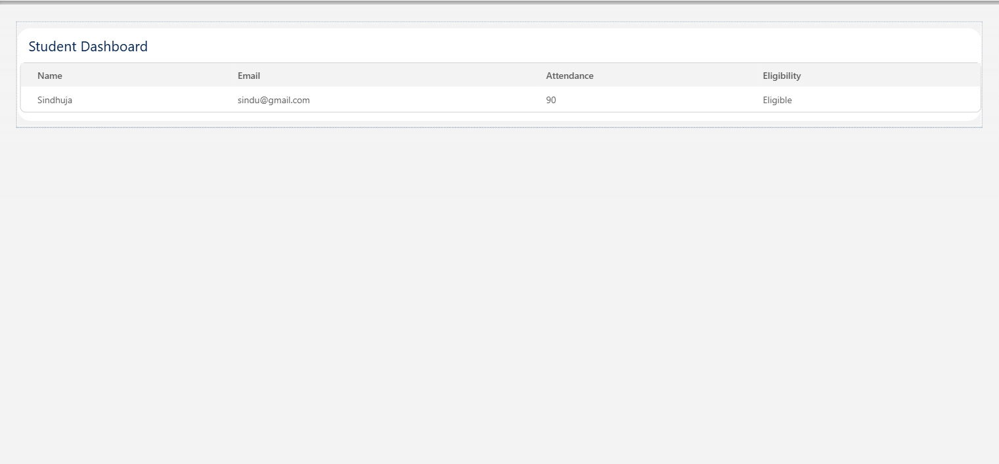
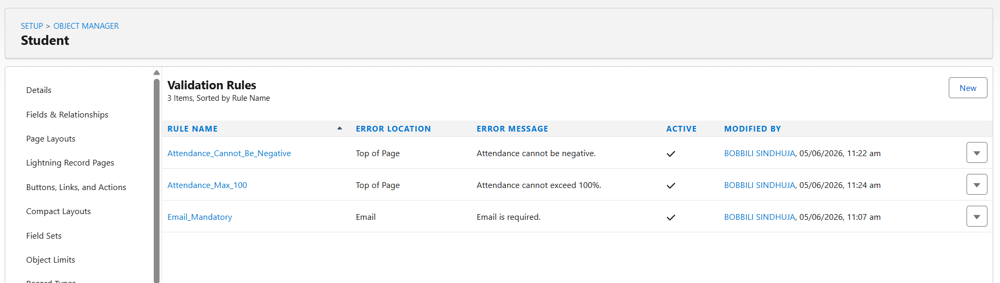
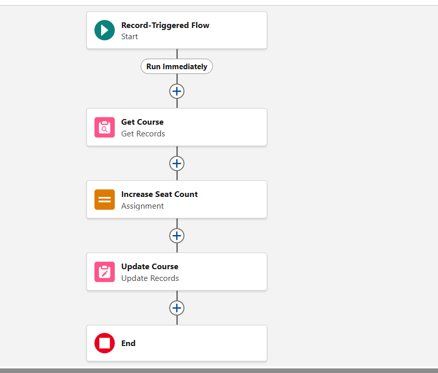
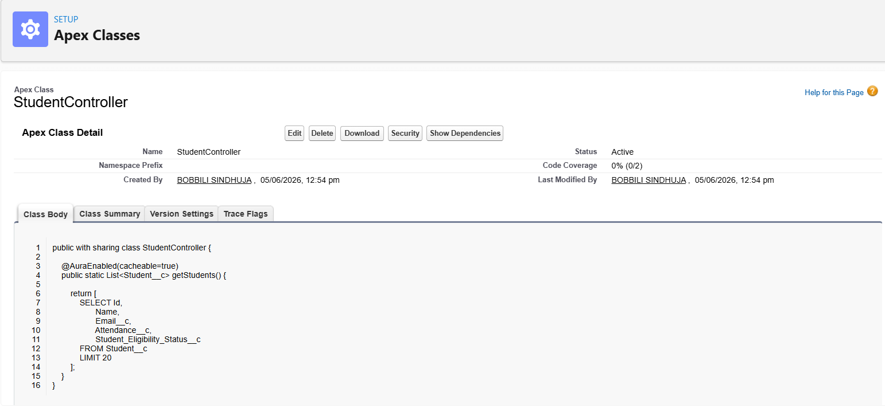

# End-to-End Workflow

# Student Registration Workflow

## Introduction

Enterprise applications are not built as isolated features.

Every user action passes through multiple system layers before producing a final result.

This document explains the complete Student Registration Workflow implemented in the College Management System.

The workflow demonstrates how Salesforce combines:

* User Interface
* Validation Rules
* Automation
* Apex Logic
* Database Operations
* Approval Processes
* Dashboard Updates

into a single integrated business process.

---

# Business Scenario

A student wants to register for a course.

The system must:

* Verify information
* Validate business rules
* Create registration records
* Approve registrations
* Update enrollment counts
* Refresh dashboard information

without requiring manual intervention.

---

# Complete Workflow Architecture

```text
Student Dashboard (UI)
         ↓
Registration Form
         ↓
Validation Rules
         ↓
Registration Record Created
         ↓
Registration Auto Approval Flow
         ↓
Course Seat Update Flow
         ↓
Database Updated
         ↓
Apex Controller Retrieves Data
         ↓
Dashboard Refresh
```

---

# Step 1: User Interface Layer

## Component

Student Dashboard

Technology:

```text
Lightning Web Component (LWC)
```

Purpose:

Provide an interface for viewing student information and registrations.

Displayed Information:

* Student Name
* Email
* Attendance
* Eligibility Status

---

# Screenshot



---

# Step 2: Registration Submission

A student submits a course registration.

Example:

```text
Student: DVS

Course: Salesforce Development

Status: Pending
```

Salesforce creates a Registration record.

Object:

```text
Registration
```

---

# Step 3: Validation Layer

Before the record is accepted, Salesforce validates business rules.

Implemented Validation Rules:

## Email Mandatory

Ensures student email is provided.

---

## Registration Date Validation

Prevents future registration dates.

---

## Seat Limit Validation

Prevents course overbooking.

---

# Validation Workflow

```text
Registration Submitted
         ↓
Validation Rules Execute
         ↓
Valid Data ?
       /      \
     Yes      No
      ↓        ↓
 Continue   Error Message
```

---

# Screenshot



---

# Step 4: Registration Auto Approval Flow

After successful validation:

```text
Registration Record Created
```

Salesforce Flow automatically executes.

Flow:

```text
Registration Auto Approval Flow
```

Purpose:

Automatically approve registrations.

---

# Flow Logic

```text
Registration Created
         ↓
Flow Triggered
         ↓
Status Updated
         ↓
Approved
```

---

# Screenshot


---

# Step 5: Course Seat Update Flow

After approval:

Salesforce automatically updates course enrollment.

Purpose:

Maintain accurate seat counts.

---

# Flow Logic

```text
Registration Created
         ↓
Get Course
         ↓
Increase Filled Seats
         ↓
Update Course
```

---

# Screenshot



---

# Step 6: Database Layer

After automation completes:

Salesforce database stores updated information.

Updated Records:

## Registration

```text
Status = Approved
```

---

## Course

```text
Filled Seats Increased
```

---

## Formula Fields

Automatically recalculated:

* Remaining Seats
* Course Full Status

---

# Database Benefits

* Consistent data
* Centralized storage
* Real-time updates

---

# Step 7: Apex Layer

After database updates:

Apex retrieves information.

Class Used:

```text
StudentController
```

Purpose:

Retrieve student information using SOQL.

---

# Apex Architecture

```text
Database
      ↓
SOQL Query
      ↓
StudentController
      ↓
LWC Dashboard
```

---

# Screenshot



---

# Step 8: Dashboard Update

The Student Dashboard automatically displays updated information.

Displayed Information:

* Student Name
* Attendance
* Eligibility Status
* Registration Details

---

# Dashboard Architecture

```text
Database Updated
        ↓
Apex Controller
        ↓
LWC Refresh
        ↓
Updated Dashboard
```

---

# Screenshot


---

# Approval Process Thinking

Current Project:

```text
Automatic Approval
```

Enterprise Version:

```text
Student Registration
         ↓
Faculty Approval
         ↓
Department Approval
         ↓
Final Approval
```

Benefits:

* Better governance
* Improved control
* Reduced errors

---

# Notification Layer

Current Project:

No notification implementation.

Future Enhancement:

```text
Registration Approved
         ↓
Email Notification
         ↓
Student Receives Confirmation
```

Possible Technologies:

* Email Alerts
* Salesforce Notifications
* Agentforce Assistant

---

# Error Handling

Potential Errors:

## Invalid Email

Blocked by Validation Rules.

---

## Future Registration Date

Blocked by Validation Rules.

---

## Full Course

Blocked by Seat Limit Validation.

---

# Workflow Benefits

This workflow provides:

* Automation
* Data Accuracy
* Faster Processing
* Reduced Manual Work
* Better User Experience

---

# Enterprise Perspective

This workflow demonstrates how enterprise applications combine:

* Frontend
* Backend
* Automation
* Business Rules
* Database Processing

to complete a business transaction.

Each layer has a specific responsibility, resulting in a scalable and maintainable architecture.

---

# Learning Outcome

Through workflow analysis, I learned that enterprise applications are not built as isolated components.

A single business action passes through multiple layers including:

* UI
* Validation
* Automation
* Business Logic
* Database
* Reporting

before producing a final outcome.

Understanding these interactions is essential for designing scalable Salesforce solutions.

---

# Conclusion

The Student Registration Workflow demonstrates a complete end-to-end enterprise business process.

The workflow integrates Lightning Web Components, Validation Rules, Flows, Apex, Database Operations, and Dashboard Updates into a unified solution that automates registration management while maintaining data quality and operational efficiency.
