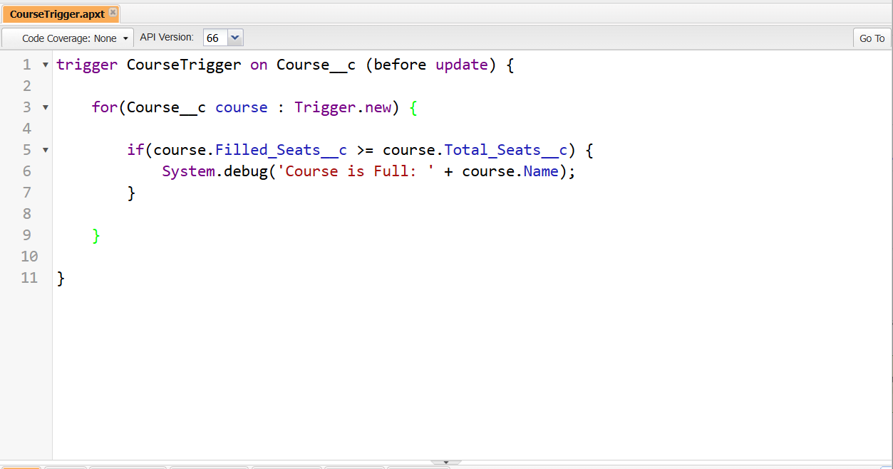
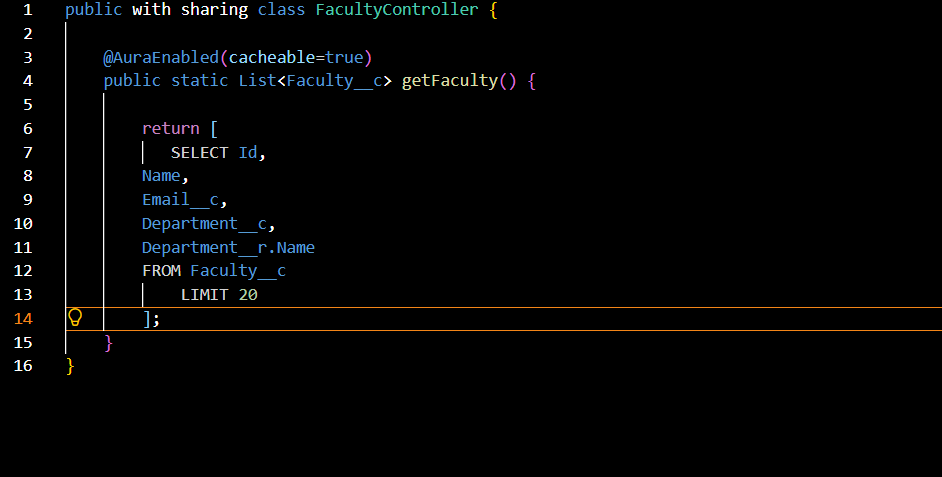

# 💻 Apex Components Documentation

## Overview

Apex was used to implement custom business logic and provide backend support for Lightning Web Components.

The College Management System includes:

- Apex Trigger
- Apex Classes
- SOQL Queries
- LWC Integration

---

# Apex Architecture

```text
Lightning Web Component
            ↓
      Apex Controller
            ↓
        SOQL Query
            ↓
      Salesforce Data
```

---

# Apex Trigger

## CourseTrigger

### Purpose

The CourseTrigger monitors course seat capacity and supports enrollment management.

---

### Trigger Type

```text
Before Update Trigger
```

---

### Business Scenario

When a course is updated:

```text
Filled Seats >= Total Seats
```

the trigger identifies that the course has reached capacity.

---

### Trigger Logic

```text
Course Updated
       ↓
Trigger Executes
       ↓
Check Filled Seats
       ↓
Check Total Seats
       ↓
Detect Full Course
```

---

### Sample Code

```apex
trigger CourseTrigger on Course__c (before update) {

    for(Course__c course : Trigger.new){

        if(course.Filled_Seats__c >= course.Total_Seats__c){

            System.debug('Course Full');
        }
    }
}
```

---

### Business Benefits

- Detects full courses.
- Supports enrollment management.
- Provides custom backend logic.

---

### Screenshot



---

# Apex Class 1

## StudentController

### Purpose

Provides student data to the Student Dashboard Lightning Web Component.

---

### Architecture

```text
Student Dashboard
        ↓
StudentController
        ↓
SOQL Query
        ↓
Student Records
```

---

### SOQL Query

```apex
SELECT Id,
       Name,
       Email__c,
       Attendance__c
FROM Student__c
```

---

### Sample Code

```apex
public with sharing class StudentController {

    @AuraEnabled(cacheable=true)
    public static List<Student__c> getStudents(){

        return [
            SELECT Id,
                   Name,
                   Email__c,
                   Attendance__c
            FROM Student__c
        ];
    }
}
```

---

### Business Benefits

- Retrieves student data efficiently.
- Supports dashboard rendering.
- Demonstrates Apex-LWC integration.

---

### Screenshot


---

# Apex Class 2

## FacultyController

### Purpose

Provides faculty data to the Faculty Dashboard Lightning Web Component.

---

### Architecture

```text
Faculty Dashboard
        ↓
FacultyController
        ↓
SOQL Query
        ↓
Faculty Records
```

---

### SOQL Query

```apex
SELECT Id,
       Name,
       Email__c,
       Department__c
FROM Faculty__c
```

---

### Sample Code

```apex
public with sharing class FacultyController {

    @AuraEnabled(cacheable=true)
    public static List<Faculty__c> getFaculty(){

        return [
            SELECT Id,
                   Name,
                   Email__c,
                   Department__c
            FROM Faculty__c
            LIMIT 20
        ];
    }
}
```

---

### Business Benefits

- Retrieves faculty information.
- Supports Faculty Dashboard.
- Demonstrates reusable Apex services.

---

### Screenshot




---

# SOQL Usage

## Student Query

```apex
SELECT Id,
       Name,
       Email__c,
       Attendance__c
FROM Student__c
```

Purpose:

```text
Retrieve student records.
```

---

## Faculty Query

```apex
SELECT Id,
       Name,
       Email__c,
       Department__c
FROM Faculty__c
```

Purpose:

```text
Retrieve faculty records.
```

---

# Apex-LWC Integration

## Student Dashboard Flow

```text
Student Dashboard
         ↓
StudentController
         ↓
SOQL Query
         ↓
Student Data Returned
         ↓
Dashboard Updated
```

---

## Faculty Dashboard Flow

```text
Faculty Dashboard
         ↓
FacultyController
         ↓
SOQL Query
         ↓
Faculty Data Returned
         ↓
Dashboard Updated
```

---

# Security Considerations

The Apex classes use:

```apex
with sharing
```

Benefits:

- Respects Salesforce sharing rules.
- Protects sensitive data.
- Supports secure access control.

---

# Performance Considerations

The Apex controllers use:

```apex
@AuraEnabled(cacheable=true)
```

Benefits:

- Improves performance.
- Reduces server calls.
- Enhances dashboard responsiveness.

---

# Learning Outcome

Through Apex development, I learned:

- Apex Syntax
- SOQL Queries
- Trigger Development
- Controller Design
- LWC Integration
- Backend Architecture

---

# Conclusion

The Apex layer provides custom business logic and backend services for the College Management System. It demonstrates how Apex, SOQL, and Lightning Web Components work together to build scalable Salesforce applications.
