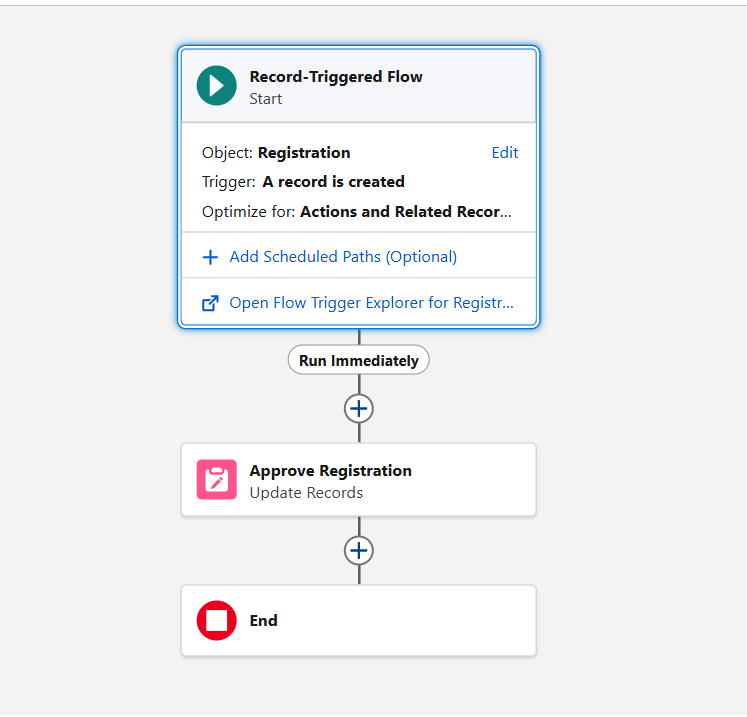

# ⚙️ Automation Flows Documentation

## Overview

Salesforce Flow Builder was used to automate business processes within the College Management System.

The automation layer reduces manual effort, improves data accuracy, and ensures consistent business operations.

---

# Flow Architecture

```text
User Action
     ↓
Record Creation
     ↓
Flow Triggered
     ↓
Business Logic Executed
     ↓
Database Updated
```

---

# Flow 1: Registration Approval Flow

## Purpose

Automatically manages the registration approval process.

---

## Trigger

```text
When Registration Record is Created
```

---

## Flow Type

```text
Record-Triggered Flow
```

---

## Business Scenario

When a student registers for a course:

```text
Student
    ↓
Creates Registration
    ↓
Status Assigned
    ↓
Pending / Approved
```

The system automatically updates the registration workflow.

---

## Flow Logic

```text
Registration Created
         ↓
Flow Triggered
         ↓
Update Registration Status
         ↓
Save Record
```

---

## Components Used

### Start Element

```text
Record Created
```

---

### Update Records Element

Updates:

```text
Status
```

Value:

```text
Pending
```

(Current Day 19 enhancement)

---

## Business Benefits

- Standardized registration process
- Reduced manual effort
- Improved workflow consistency
- Better approval tracking

---

## Screenshot




---

# Flow 2: Course Seat Update Flow

## Purpose

Automatically updates course enrollment counts whenever a registration is created.

---

## Trigger

```text
When Registration Record is Created
```

---

## Flow Type

```text
Record-Triggered Flow
```

---

## Business Scenario

A student registers for a course.

The system automatically updates:

```text
Filled Seats
```

inside the Course object.

---

## Flow Logic

```text
Registration Created
          ↓
Get Course Record
          ↓
Increase Filled Seats
          ↓
Update Course
```

---

## Components Used

### Start Element

```text
Registration Created
```

---

### Get Records

Fetches:

```text
Course Record
```

using:

```text
Course Lookup
```

---

### Assignment Element

Updates:

```text
Filled Seats = Filled Seats + 1
```

---

### Update Records

Saves updated course information.

---

## Example

Before Registration:

```text
Total Seats = 60
Filled Seats = 20
Remaining Seats = 40
```

After Registration:

```text
Total Seats = 60
Filled Seats = 21
Remaining Seats = 39
```

---

## Business Benefits

- Eliminates manual seat tracking
- Improves enrollment accuracy
- Supports real-time reporting
- Reduces administrative work

---

## Screenshot


---

# Flow Integration

The two flows work together:

```text
Student Registration
         ↓
Registration Approval Flow
         ↓
Registration Status Updated
         ↓
Course Seat Update Flow
         ↓
Course Enrollment Updated
```

---

# Error Prevention

The automation layer works alongside validation rules:

### Course Capacity Check

```text
Full Course
     ↓
Registration Blocked
```

---

### Duplicate Registration Prevention

```text
Student + Course
      ↓
Duplicate Registration Blocked
```

---

# Day 19 Improvements

Additional workflow enhancements added:

## Approval Comments

Allows approvers to record decisions.

Example:

```text
Approved by Faculty.
Student meets eligibility requirements.
```

---

## Approval Date

Tracks:

```text
When approval occurred.
```

---

## Registration Status

Supports:

```text
Pending
Approved
Rejected
```

---

# Automation Benefits

The automation layer provides:

- Faster processing
- Reduced manual work
- Improved consistency
- Better enrollment tracking
- Real-time updates

---

# Learning Outcome

Through Salesforce Flows, I learned how business processes can be automated without writing code.

Flow Builder allows organizations to create scalable, maintainable automation while reducing operational complexity.

---

# Conclusion

The automation layer of the College Management System demonstrates how Salesforce Flow Builder can automate registration processing, seat management, and workflow tracking while maintaining data accuracy and consistency.
