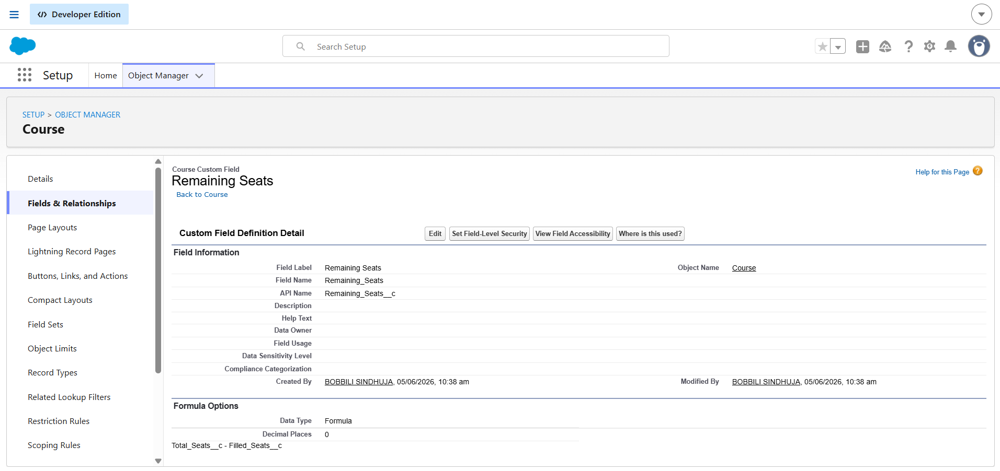
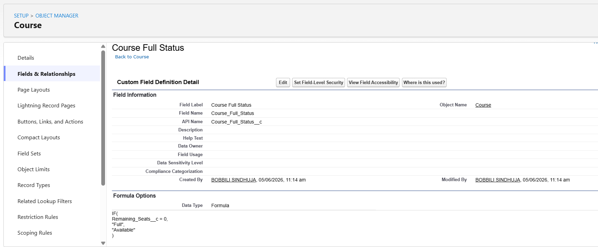
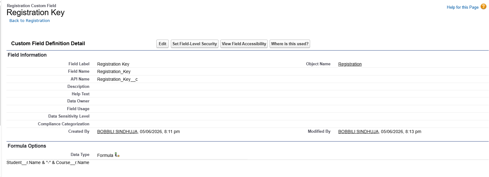

# 🧮 Formula Fields Documentation

## Overview

Formula Fields are used to automatically calculate values without requiring manual updates.

The College Management System uses formula fields to automate attendance evaluation, student eligibility determination, seat calculations, and course availability tracking.

---

# Student Object Formula Fields

---

## 1. Attendance Status

### Purpose

Determines whether a student's attendance is satisfactory.

### Field Type

```text
Formula (Text)
```

### Formula

```salesforce
IF(
    Attendance__c >= 0.75,
    "Good Standing",
    "Low Attendance"
)
```

### Example

| Attendance | Result |
|------------|---------|
| 90% | Good Standing |
| 80% | Good Standing |
| 65% | Low Attendance |
| 50% | Low Attendance |

### Business Impact

- Quickly identifies attendance issues.
- Reduces manual monitoring.
- Supports academic decision-making.

### Screenshot


---

## 2. Student Eligibility Status

### Purpose

Determines whether a student is eligible based on attendance.

### Field Type

```text
Formula (Text)
```

### Formula

```salesforce
IF(
    Attendance__c >= 0.75,
    "Eligible",
    "Not Eligible"
)
```

### Example

| Attendance | Result |
|------------|---------|
| 85% | Eligible |
| 90% | Eligible |
| 60% | Not Eligible |
| 70% | Not Eligible |

### Business Impact

- Supports eligibility verification.
- Helps faculty make academic decisions.
- Automates eligibility evaluation.

### Screenshot


---

# Course Object Formula Fields

---

## 3. Remaining Seats

### Purpose

Calculates available seats automatically.

### Field Type

```text
Formula (Number)
```

### Formula

```salesforce
Total_Seats__c - Filled_Seats__c
```

### Example

| Total Seats | Filled Seats | Remaining Seats |
|-------------|--------------|-----------------|
| 60 | 20 | 40 |
| 50 | 45 | 5 |
| 100 | 100 | 0 |

### Business Impact

- Eliminates manual calculations.
- Improves enrollment tracking.
- Provides real-time seat availability.

### Screenshot




---

## 4. Course Full Status

### Purpose

Determines whether a course has reached maximum capacity.

### Field Type

```text
Formula (Text)
```

### Formula

```salesforce
IF(
    Remaining_Seats__c = 0,
    "Course Full",
    "Seats Available"
)
```

### Example

| Remaining Seats | Result |
|-----------------|---------|
| 40 | Seats Available |
| 15 | Seats Available |
| 0 | Course Full |

### Business Impact

- Provides instant course availability information.
- Supports enrollment decisions.
- Improves seat management.

### Screenshot




---

## 5. Course Full Check

### Purpose

Used by validation rules to block registrations for full courses.

### Field Type

```text
Formula (Checkbox)
```

### Formula

```salesforce
Course__r.Course_Full_Status__c = "Course Full"
```

### Example

| Course Status | Checkbox Value |
|---------------|----------------|
| Course Full | TRUE |
| Seats Available | FALSE |

### Business Impact

- Prevents overbooking.
- Supports registration validation.
- Improves data integrity.

### Screenshot


---

# Registration Object Formula Fields

---

## 6. Registration Key

### Purpose

Creates a unique identifier for each student-course combination.

### Field Type

```text
Formula (Text)
```

### Formula

```salesforce
Student__r.Name & "-" & Course__r.Name
```

### Example

| Student | Course | Result |
|----------|---------|---------|
| Sindhuja | Salesforce Development | Sindhuja-Salesforce Development |
| Ravi | CRM Fundamentals | Ravi-CRM Fundamentals |

### Additional Configuration

```text
Unique = TRUE
```

### Business Impact

- Prevents duplicate registrations.
- Maintains enrollment integrity.
- Supports accurate reporting.

### Screenshot



---

# Formula Field Summary

| Formula Field | Object | Purpose |
|---------------|---------|----------|
| Attendance Status | Student | Attendance evaluation |
| Student Eligibility Status | Student | Eligibility determination |
| Remaining Seats | Course | Seat calculation |
| Course Full Status | Course | Course availability |
| Course Full Check | Registration | Capacity validation |
| Registration Key | Registration | Duplicate prevention |

---

# Benefits of Formula Fields

The formula fields provide:

- Automatic calculations
- Consistent business logic
- Real-time updates
- Reduced manual work
- Improved data quality

---

# Conclusion

Formula fields play a critical role in automating calculations and enforcing business rules within the College Management System. They reduce manual effort while improving accuracy and consistency across the application.
