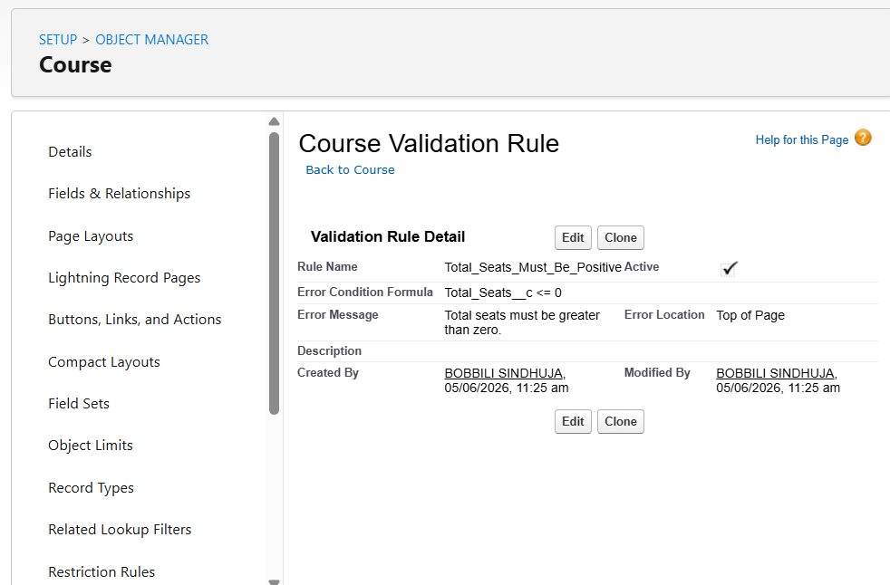

# ✅ Validation Rules Documentation

## Overview

Validation Rules are used to enforce business logic and maintain data quality in the College Management System.

These rules prevent users from entering invalid or inconsistent data.

---

# Student Object Validation Rules

---

## 1. Email Mandatory

### Purpose

Ensures that every student record contains an email address.

### Validation Rule Name

```text
Email_Mandatory
```

### Formula

```salesforce
ISBLANK(Email__c)
```

### Error Message

```text
Email is required.
```

### Error Location

```text
Email Field
```

### Business Impact

- Prevents incomplete student records.
- Ensures communication details are available.
- Improves data quality.

### Screenshot


---

## 2. Attendance Max 100

### Purpose

Prevents attendance percentage from exceeding 100%.

### Validation Rule Name

```text
Attendance_Max_100
```

### Formula

```salesforce
Attendance__c > 1
```

### Error Message

```text
Attendance cannot exceed 100%.
```

### Error Location

```text
Top of Page
```

### Business Impact

- Prevents unrealistic attendance values.
- Maintains academic record accuracy.

### Screenshot


---

# Course Object Validation Rules

---

## 3. Seat Limit Check

### Purpose

Ensures filled seats never exceed total seats.

### Validation Rule Name

```text
Seat_Limit_Check
```

### Formula

```salesforce
Filled_Seats__c > Total_Seats__c
```

### Error Message

```text
Filled seats cannot exceed total seats.
```

### Error Location

```text
Top of Page
```

### Business Impact

- Prevents overbooking.
- Maintains enrollment accuracy.
- Ensures seat calculations remain valid.

### Screenshot


---

## 4. Total Seats Must Be Positive

### Purpose

Ensures courses cannot have zero or negative seat capacity.

### Validation Rule Name

```text
Total_Seats_Must_Be_Positive
```

### Formula

```salesforce
Total_Seats__c <= 0
```

### Error Message

```text
Total seats must be greater than zero.
```

### Error Location

```text
Top of Page
```

### Business Impact

- Prevents invalid course creation.
- Ensures realistic enrollment capacity.

### Screenshot


---

# Registration Object Validation Rules

---

## 5. Registration Date Cannot Be Future Date

### Purpose

Prevents users from entering future registration dates.

### Validation Rule Name

```text
Registration_Date_Cannot_Be_Future_Date
```

### Formula

```salesforce
Registration_Date__c > TODAY()
```

### Error Message

```text
Registration date cannot be in the future.
```

### Error Location

```text
Top of Page
```

### Business Impact

- Ensures accurate registration history.
- Prevents invalid registration records.

### Screenshot


---

## 6. Course Capacity Check

### Purpose

Prevents registrations when a course is already full.

### Validation Rule Name

```text
Course_Capacity_Check
```

### Formula

```salesforce
Course_Full_Check__c
```

### Error Message

```text
This course is already full. Registration cannot be created.
```

### Error Location

```text
Top of Page
```

### Business Impact

- Prevents course overbooking.
- Improves enrollment control.
- Maintains seat integrity.

### Screenshot




---

## 7. Duplicate Registration Prevention

### Purpose

Prevents the same student from registering for the same course multiple times.

### Implementation

Uses:

```text
Registration Key Formula Field
```

Combined value:

```text
Student Name + Course Name
```

Example:

```text
Sindhuja-Salesforce Fundamentals
```

The field is marked:

```text
Unique
```

### Business Impact

- Prevents duplicate registrations.
- Maintains enrollment integrity.
- Ensures accurate reporting.

### Screenshot


---

# Summary

| Validation Rule | Object | Purpose |
|-----------------|---------|----------|
| Email Mandatory | Student | Require email |
| Attendance Max 100 | Student | Prevent invalid attendance |
| Seat Limit Check | Course | Prevent overbooking |
| Total Seats Positive | Course | Valid seat capacity |
| Registration Future Date | Registration | Valid registration dates |
| Course Capacity Check | Registration | Block full courses |
| Duplicate Registration Prevention | Registration | Prevent duplicate enrollments |

---

# Conclusion

The validation rules ensure that the College Management System maintains high-quality, accurate, and reliable academic data while preventing common user-entry errors.
